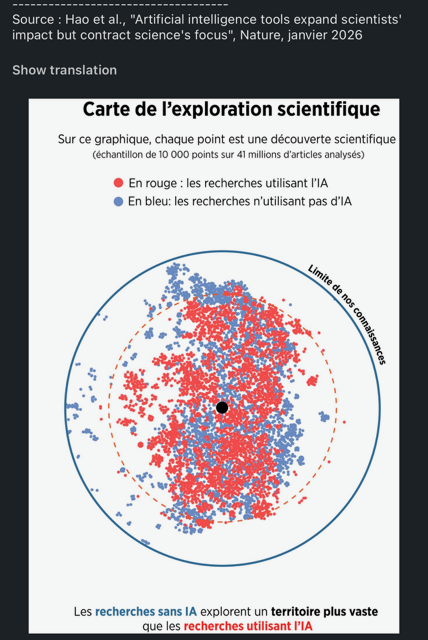

# Intro

This is meant as an inventory/tracking on Cybersecurity-related information on the several aspects of GenAI.

This page should evolve over time.

# Papers

## On LLMs 

<https://arxiv.org/pdf/2501.11223>

(not a paper, a presentation, but still) <https://i.blackhat.com/BH-USA-25/Presentations/US-25-Lynch-From-Prompts-to-Pwns.pdf>

<https://www.acpjournals.org/doi/10.7326/aimcc.2024.1260>

### limits

\<TBC\>

<https://arxiv.org/pdf/2602.06176>

### Data Privacy

[The Spanish DPA published the English version of its guidelines on processing personal data through Agentic AI](https://www.linkedin.com/posts/luisalbertomontezuma_ai-activity-7433533829488963584-DoB1/)

## On (genAI) Agents

["Agents of Chaos"](https://www.researchgate.net/publication/401123335_Agents_of_Chaos)

[Threat Modelling AI-Agents Protocols](https://arxiv.org/abs/2602.11327)

[Google’s Approach for Secure AI Agents: An Introduction](https://storage.googleapis.com/gweb-research2023-media/pubtools/1018686.pdf)

# Other

## Githubs

<https://github.com/Stanford-Trinity/ARTEMIS>

## More considerations/context

<https://www.theverge.com/ai-artificial-intelligence/827820/large-language-models-ai-intelligence-neuroscience-problems>

<https://www.gartner.com/en/documents/7211030>

<https://msukhareva.substack.com/p/ai-agent-governance-a-bureaucracy>

<https://www.zdnet.com/article/perplexity-computer-openclaw/>

<https://www.technologyreview.com/2026/02/11/1132768/is-a-secure-ai-assistant-possible/amp/>

<https://www.bleepingcomputer.com/news/microsoft/microsoft-says-bug-causes-copilot-to-summarize-confidential-emails/amp/>

<https://adnanthekhan.com/posts/clinejection/>

<https://www.linkedin.com/posts/mirandarid_aisecurity-ai-cyber-activity-7397400647060336640-AvGj/>

<https://futurism.com/ai-browser-hackers-drain-bank-account-public-reddit-post>

<https://www.linkedin.com/posts/eito-miyamura-157305121_perplexity-comets-ai-agent-just-bankrupted-ugcPost-7386434002011869185-KkQ-/>

<https://deepmind.google/blog/advancing-geminis-security-safeguards/>

<https://www.linkedin.com/posts/gianlucamauro_lets-go-through-a-scenario-imagine-john-activity-7383499847057948674-qaJk/>

<https://www.404media.co/librarians-are-being-asked-to-find-ai-hallucinated-books/>

<https://abovethelaw.com/2025/07/trial-court-decides-case-based-on-ai-hallucinated-caselaw/>

### E.g. Cowork

As stated here (as of end of Feb 2026) <https://claude.com/blog/cowork-research-preview>

"That said, there are still things to be aware of before you give Claude control. By default, the main thing to know is that Claude can take potentially destructive actions (such as deleting local files) if it’s instructed to. Since there’s always some chance that Claude might misinterpret your instructions, you should give Claude very clear guidance around things like this. 

You should also be aware of the risk of “[prompt injections](https://www.anthropic.com/research/prompt-injection-defenses)”: attempts by attackers to alter Claude’s plans through content it might encounter on the internet. We’ve built sophisticated defenses against prompt injections, but agent safety—that is, the task of securing Claude’s real-world actions—is still an active area of development in the industry. 

These risks aren’t new with Cowork, but it might be the first time you’re using a more advanced tool that moves beyond a simple conversation. We recommend taking precautions, particularly while you learn how it works. We provide more detail in our [Help Center](https://support.claude.com/en/articles/13364135-using-cowork-safely)."

### From Cursor

<https://cursor.com/blog/agent-sandboxing>

## Other limits

## MEMEs

Unfortunately not sharing until I gather authorization to share my collection of screenshots, although all of them are from public Internet (LinkedIn screenshots mostly).
