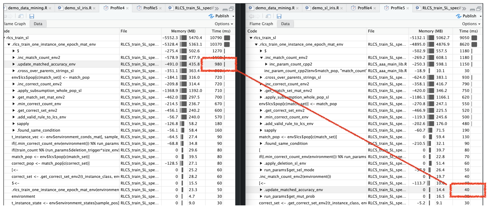

## I got help...

Someone (who I'll present hopefully in due time) suggested I should look into Zero-Copy for my RCpp calls because well... It was poor practice, what I was doing.

I want to hereby thank him (I did over email already).

Then there comes a point where faster processing of one function is not something that can be pushed forever, but while re-working the code, I concluded the slowest (by then) overall function (i.e. most called \* processing time per call) could in fact... Not be called all that often!

## Zero Copy

So mostly, "all I did" was pass variables as pointers into C++. That helped, because well, as the name goes, it skips copying data.

It did improve things, for sure, but by now I have only a very small fraction of code that actually requires C++ functions (i.e. see [this message](https://kaizen-r.github.io/posts/2025-11-14_Comparing_RLCS_to_RF_PartIII/index.html#matching-can-be-done-with-matrices) in a past post). So the overall saved time is minimal, unfortunately.

I didn't run all the numbers, but we're talking 2% overall maybe (better than nothing **for sure!**)

## Updating accuracy

So there is another thing. See accuracy updating, whereby for each rule in a population (or sub-population) you simply calculate (# correct/ \# match), well...

See the simplified algorithm kinda implies you should update accuracy with each match or correct point update, which happens basically for each sample of the train set, for each iteration of the training.

**But in reality, accuracy is only needed before sorting!**

And you only sort the population (or a subset of it, like the match set!) ever so often!

I know, many "!" signs, but it's just that it does make more of a difference right there:

In one speed test, we're talking 10% processing time reduction. (That does depend on size of training set, and several other hyperparameters, but still...)

## Conclusions

Well, I still try my best. Small improvements.

But improvements, non-the-less.
