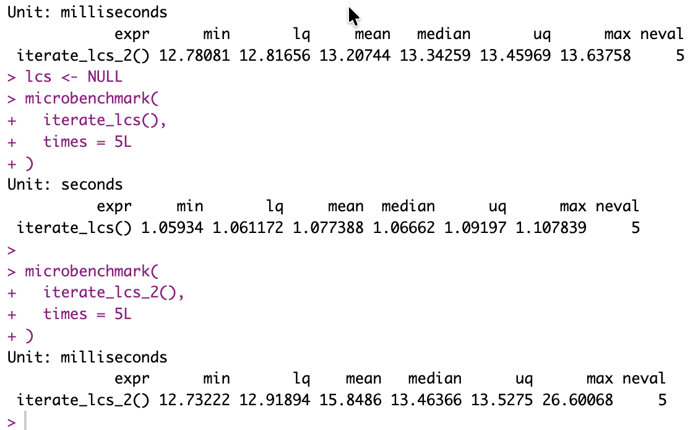

## **Intro**

It just kinda makes sense:

In R when you call a function with variables, by default, objects are passed, and IF you change one of the objects, a copy of it is first created, then changed. It doesn't change in the calling environment, so it's somewhat safer...

However, there is a way to avoid it, and behave slightly more like a C pointer thing: Pass environment references.

No copies. Just changes on the same object...

And here goes the reason of this post: If you pass an object, a large one at that, and you mean to change it in a function, and then return the resulting changed object: You create a copy in each iteration of the loop. Which seems sub-optimal.

Well... It is.

## Results first

Here is the summary:



There you have it, look at the units! Milliseconds instead of seconds.

But you don't have to take my word for it.

## The Code for today

``` r
library(microbenchmark)

## Variable-passing, with copy-on-modify
add_random_num_to_list <- function(lcs = NULL) {
  if(is.null(lcs)) lcs <- list()
  lcs[[length(lcs)+1]] <- round(runif(1), 4)*10000
  lcs
}

## iterating to gather some time count...
iterate_lcs <- function() {
  lcs <- list()
  for(i in 1:10000) {
    lcs <- add_random_num_to_list(lcs)
  }
  lcs
}

## Modify variable in parent env:
add_random_num_to_list_parent_env <- function(env) {
  env$lcs[[length(env$lcs)+1]] <- round(runif(1), 4)*10000
}

## Same exact functionality as the other, but using environments (ref)
iterate_lcs_2 <- function() {
  lcs <- list()
  for(i in 1:10000) {
    add_random_num_to_list_parent_env(environment())
  }
  lcs
}

## Check that it works:
lcs <- NULL
lcs <- iterate_lcs()
length(lcs)
lcs <- NULL
lcs <- iterate_lcs_2()
length(lcs)

microbenchmark(
  iterate_lcs(),
  times = 5L
)

microbenchmark(
  iterate_lcs_2(),
  times = 5L
)
```

## Why would I care?

Because of RLCS. I do this the slow way, and in millions of iterations, passing rather huge objects. And Garbage Collection is affecting too.

Given the above tests, I can improve the code greatly. I now know I can. By reducing the passing of objects.

And given RLCS is still hugely slow... This is great news for me.

## Conclusions

This is not the normal way of doing things; R protects us from making mistakes with its default behaviour.

But, if you're careful... Sometimes the defaults are worse than what you can get, performance-wise.

## References

<https://adv-r.hadley.nz/environments.html>
