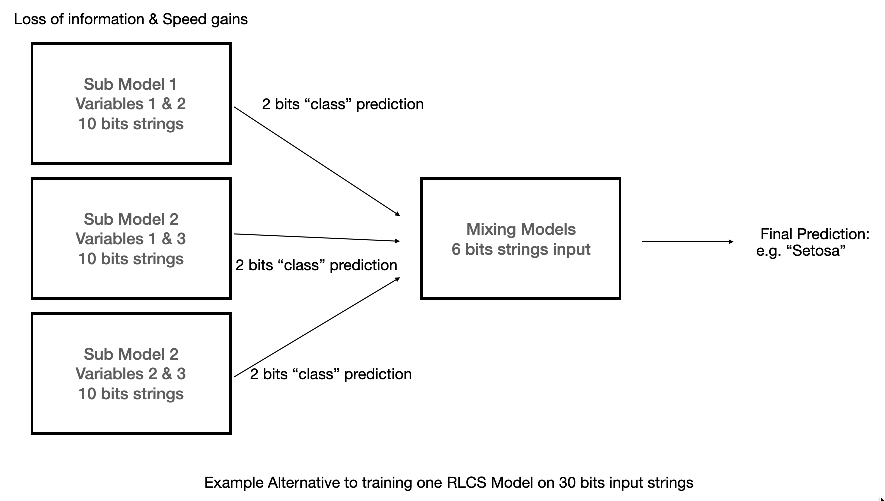
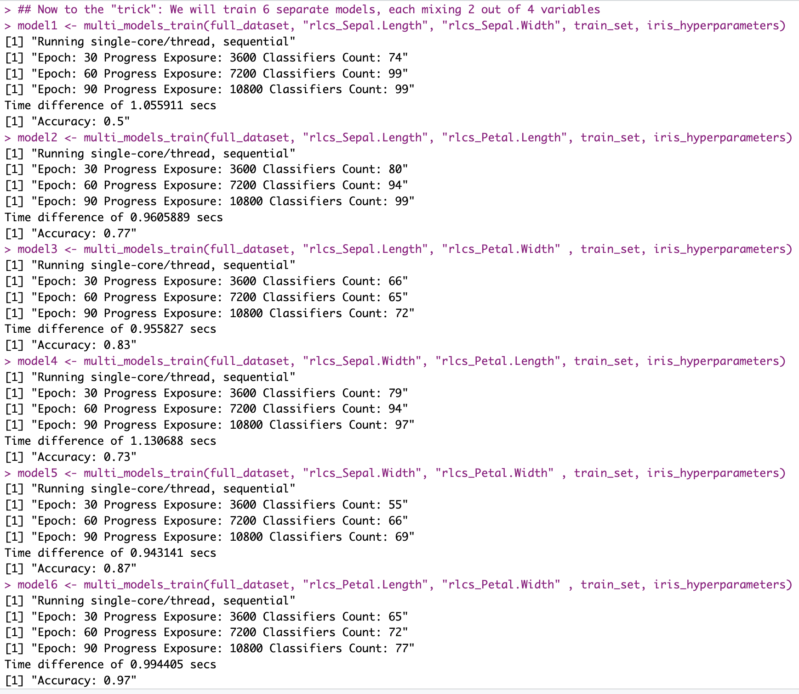
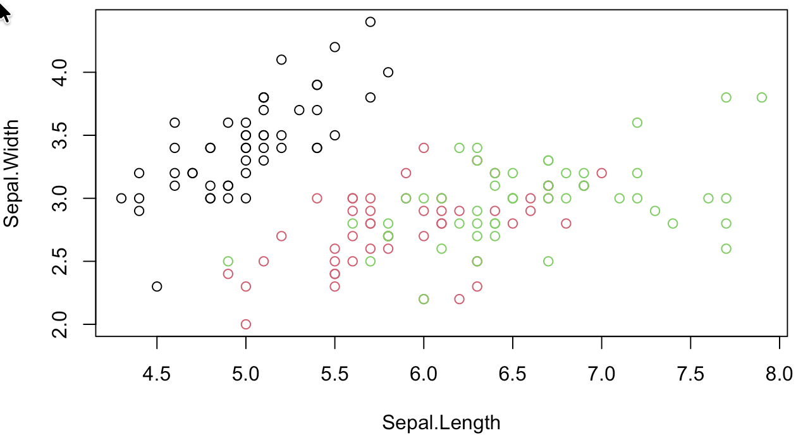
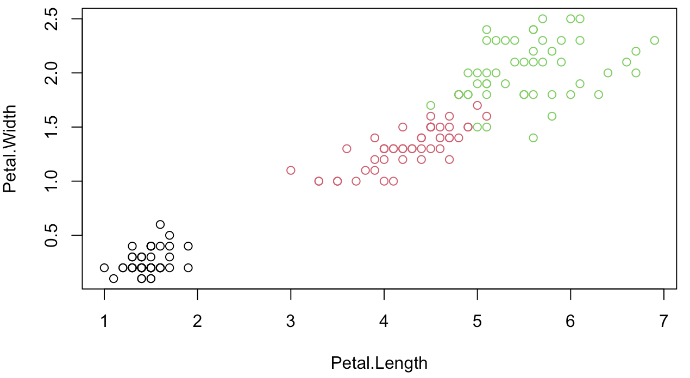

## **Intro**

The quid of the issue is the curse of dimensionality. Note that this post is not "new" in many of the concepts I will be listing today, in that most I have thought about already at some point in the past 1+ year...

OK so, although it might not look like so, I still have the issue to improve RLCS performance (in terms of runtimes, in particular) "on the back-burner" at all times... And it's nagging me, of course.

As I mentioned in the past, I want to use it for some NLP classification exercise(s). I think if I ever manage, it will be pretty cool and useful...

But NLP is high-dimensional (also already mentioned).

## Back to the drawing board

So one thing I've done is break down the problems in different ways. Horizontally, I work on subsets of rows, and then merge (just concatenating) resulting sub-models. And that works and it helps and it's faster, at least for images classification.

But I don't think that's the way for NLP.

Instead, I want to work on two things:

-   Information encoding

-   Variables pairing (subsetting)

The first one is all about how I put the text into strings of bits. I've done some DTM and Chi-Square (for selecting words with more 2-class classification power) already, with all sorts of cleaning and stemming, that kinda helps, but it's not magical. I still would need hundreds of words.

I could add semantic stuff (like, IDK, sentiment analysis). I'm convinced for some problems that will be huge, of course.

I am looking into NER (I think that will help, mixed with the DTM+Chi-Square stuff, to reduce dimensions. Like, in some cases, proper names of people and orgs will for sure help more than adjectives...

Of course, there will be time for clustering of texts, which today would be with some sort of text embedding... And then Graphs and ontologies come to mind...

For the use-case of the RLCS applied to navigating a small world (my Reinforcement Learning examples), I could encode differently the data so as to reduce the bit-strings sizes by a lot while keeping the relevant information.

That's all good and nice, but today I am considering the second approach: How about I do not use all variables in one model.

So I break down the long strings of bits in smaller substrings, which I would need to mix in some way. That is, I break the problem vertically: I don't subset by rows. I subset by variables.



## Tricky though

So suppose I have 4 variables, like in the Iris dataset.

Using only one variable to create a classifier seems like a stretch: I **could** try to create 4 classifiers, maybe one of them is good on its own!

Say maybe with knowing only the Petal Length, I can already have a "valid" classifier (after all, in this example, we know setosa can be separated from the rest rather easily as it has generally smaller petal lengths...).

But I loose the mix of data, and for sure most times that will be needed, so I can also create 6 pairs (that's basically "n choose k" problem):

$$
(^n_k)
$$

But then I could also mix 3 variables (4 combinations).

And if "n" in the above is high (as in the case of NLP with say some sort of DTM), the thing obviously explodes!

On the plus side: Training a model with RLCS on the Iris dataset to get a competitive accuracy requires 20+ seconds.

I can train 6 models using pairs of variables in 6 seconds (not parallelizing anything, which here would be an **obvious** next step...).

And doing the pairs thing actually helps surface "information":



Each of the separate models I trained "particularly fast" with hyperparameters that are not meant to optimize accuracy so much as to ensure the runtimes are contained.

And yet, it tells me that trying to create a classifier using only Sepal lengths and width will be difficult:



While maybe doing that using only Petal lengths and widths is not so crazy:



That is not of course what I suggest.

## Next step would be: Hierarchy of Models

Mixing the subsets.

So suppose I encode the 3 classes each in a 2bits string, say

``` r
sapply(full_dataset$class, \(x) switch(x,
                                 setosa = "00",
                                 versicolor = "01",
                                 "10"))
```

I can take the simpler models that we can see perform "well", and use their proposed binary strings as inputs to a second-level RLCS classifier, that would train on the resulting classification, and hopefully it would learn the right "mixes of mixes".

That's the key idea here:

I can test "fast", for a given problem, which mix of smaller subsets have a better prediction power, and then use a second layer RLCS to leverage the best subsets.

It gets complicated fast, however for very "high dimensionality" problems (like NLP), the balance with the speed gains might work out fine.

Training an RLCS on smaller strings is exponentially faster. The reduced accuracy by lost information (of multivariate) I want to see if I can compensate by mixing smaller models, maybe ensuring I cover approximately the complete ground.

The second layer training would receive much smaller bit-strings and hence would be much faster while compensating for accuracy loss of first-layer subset models.

Training smaller models in parallel could also ensure the speed gains.

## Conclusion

Once again, admittedly, I'm talking speed gains through information loss. And complicated setups. Also, I would in principle still be capable of "decoding" the resulting choices, albeit the encoding/decoding of the overall "model" would indeed be more... Intricate.

But maybe in this case the numbers add up: 3h trainings for small simple domain-specific NLP classification problems for too complex results (proposed rules with too many keywords in them) might be insufficient.

And in some cases, if I only want to discover some "good rules", I can take the loss in the more corner cases while finding good rules that work most of the time with fewer dimensions involved.

Also, for the RL case, if I manage to encode information correctly, AND I use dimensionality reduction explained today, maybe (just maybe) I can train an RLCS model much faster with same (or better results), who knows...

Yet, this doesn't preclude me from focusing some more on how to encode information as best as I can to reduce the bit-strings lengths...

Oh well...
