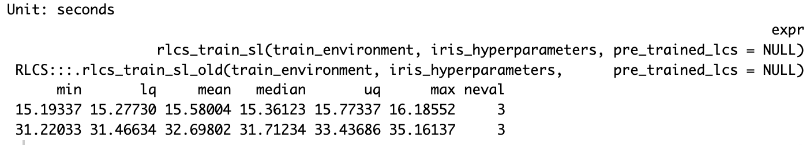
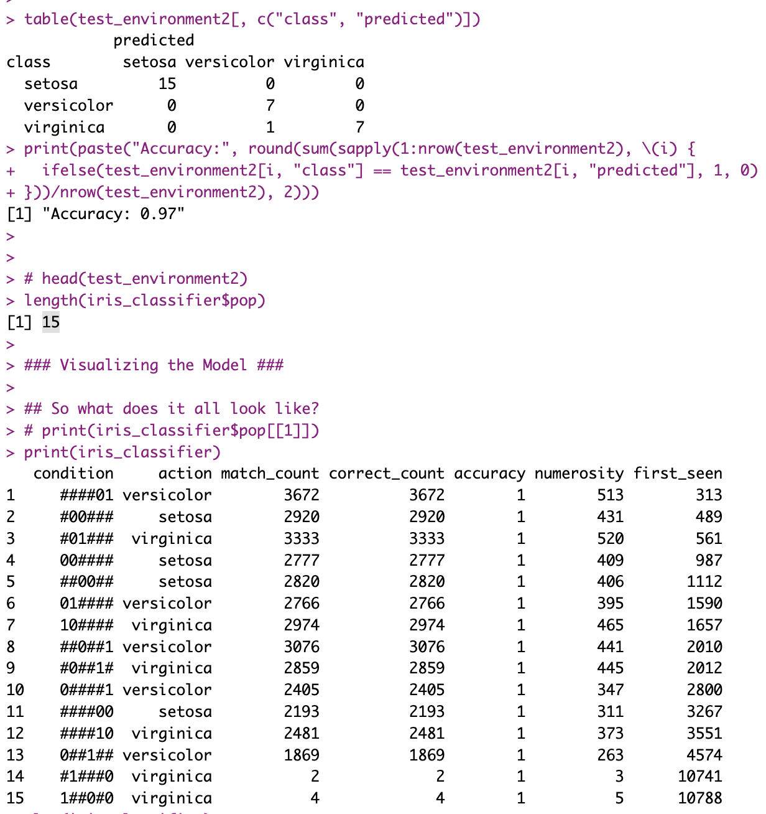

## **Intro**

So I had some time this weekend and I thought I could spend a bit on RLCS and some performance matters.

But this post has two parts:

-   One is said performance gains and how I went about it (a short summary).

-   The other is related to a recent post on distributing processing in more than one layer. And some potential implications for Reinforcement Learning.

## Part 1: Speed gains

I did [mention not that long ago](https://kaizen-r.github.io/posts/2026-02-07_UsingEnvsInsteadOfVariables/) that using environments, saving the processing cost of passing variables around (say a whole LCS population, which can grow big) several times across several functions, even with the create-on-modify trick of R, can have an impact.

Today I can confirm that using that trick and reviewing a few other details (migrating a couple of slower functions to C++ with RCpp) proved in fact useful to the RLCS package. Here goes, for the iris classification problem, run times the new way are half as long as the old way:



Obviously it's more noticeable for larger projects. And smaller states (shorter binary strings) or smaller environments don't get either such an improvement.

Still.

## Part 1.5: Multi-Layer RLCS and Iris

I also considered the [ideas from this other recent post](https://kaizen-r.github.io/posts/2026-02-21_MixingVariables/). Last time I left it as a little experiment but without getting it to its full consequence, i.e. applying it to a real classification exercise, hinting at the "hierarchy of models" but not implementing it.

Well, now it's done, and yes, it works.

First, the code, which more or less goes like so:

``` r
t_start <- Sys.time()

## Now to the "trick": We will train separate sub-models, each mixing 2 out of 4 variables
## Let's call this L1 RLCS.
## After testing, I keep only 3 of the 6 subsets, those which are most promising. Loss of information implied, of course.

# model1 <- multi_models_train(full_dataset, "rlcs_Sepal.Length", "rlcs_Sepal.Width", train_set, iris_hyperparameters)
# model2 <- multi_models_train(full_dataset, "rlcs_Sepal.Length", "rlcs_Petal.Length", train_set, iris_hyperparameters)
model3 <- multi_models_train(full_dataset, "rlcs_Sepal.Length", "rlcs_Petal.Width" , train_set, iris_hyperparameters)
# model4 <- multi_models_train(full_dataset, "rlcs_Sepal.Width", "rlcs_Petal.Length", train_set, iris_hyperparameters)
model5 <- multi_models_train(full_dataset, "rlcs_Sepal.Width", "rlcs_Petal.Width" , train_set, iris_hyperparameters)
model6 <- multi_models_train(full_dataset, "rlcs_Petal.Length", "rlcs_Petal.Width" , train_set, iris_hyperparameters)

### Encode L1 classification choices
train_environment$new_predicted3 <- multi_models_predict(train_environment, 
                                                         "rlcs_Sepal.Length", "rlcs_Petal.Width", 
                                                         model3)
train_environment$new_predicted5 <- multi_models_predict(train_environment, 
                                                         "rlcs_Sepal.Width", "rlcs_Petal.Width", 
                                                         model5)
train_environment$new_predicted6 <- multi_models_predict(train_environment, 
                                                         "rlcs_Petal.Length", "rlcs_Petal.Width", 
                                                         model6)

## Now let's create an L2 model, that uses the encoded L1 classifiers choices as input, and in turn learns from that compacted signal:
train_environment2 <- train_environment
train_environment2$state <- sapply(1:nrow(train_environment2), \(x)
                                   paste(train_environment2[x, c("new_predicted3",
                                                                 "new_predicted5",
                                                                 "new_predicted6")], collapse=""))

train_environment2 <- train_environment2[which(train_environment2$state != "######"),]

## Now we train the L2 model with the L2 training dataset:
iris_classifier <- rlcs_train_sl(train_environment2,
                              iris_hyperparameters,
                              pre_trained_lcs = NULL)
## And here we'd have a trained, 2-layers hierarchy "meta-model" based on RLCS:
t_end <- Sys.time()
print("Run time:")
print(t_end - t_start) ## Training Runtime.
```

One key part of the value of breaking the model in sub-models is that we can use better hyperparameters.

Here, the hyperparameters I usually take for the iris classifier:

``` r
## Hyperparameters are key for performance of RLCS:
iris_hyperparameters <- RLCS_hyperparameters(
  wildcard_prob = 0.3, ## Probability that covering will choose a wildcard char
  rd_trigger = 20, ## Smaller means more rules generated through GA tournament
  mutation_probability = 0.1,
  parents_selection_mode <- "tournament",
  tournament_pressure = 6,
  ## Most important parameters to vary so far:
  n_epochs = 800, ## Epochs to repeat process on train set
  deletion_trigger = 80, ## Number of epochs in between subsumption & deletion
  deletion_threshold = 0.95
)
```

And here the hyperparameters I use for this broken down approach:

``` r
## Hyperparameters are key for performance of RLCS:
iris_hyperparameters <- RLCS_hyperparameters(
  wildcard_prob = 0.2, ## Probability that covering will choose a wildcard char
  rd_trigger = 10, ## Smaller means more rules generated through GA tournament
  mutation_probability = 0.2,
  parents_selection_mode <- "tournament",
  tournament_pressure = 6,
  ## Most important parameters to vary so far:
  n_epochs = 90, ## Epochs to repeat process on train set
  deletion_trigger = 30, ## Number of epochs in between subsumption & deletion
  deletion_threshold = 0.98,
  max_pop_size = 150
)
```

You might notice in particular the number of epochs. With as many samples, but much shorter binary strings, searching the space is **much** faster and so this becomes acceptable. There is only so much information encoded in one pair of variables (instead of 4 variables at once).

You might wonder about performance. Here the screenshots:


So runtimes are divided by 3 here. And I could have parallelized the training of the 3 L1 sub-models, which in longer runtimes might make sense, whereby we would be talking in practice of going from 15 seconds to 3 seconds, 1/5 of the execution time.

Training a stochastic model with iris returns notably variable accuracy, depending on what's held-out, but regardless, I got a 97% accuracy with the hierarchical approach (incidently, only 90% accuracy with the simpler approach, but that's perfectly irrelevant: it varies with each execution!).

But what's also noticeable is that, given the L1 essentially compresses information for L2 to leverage, the L2 model is much smaller:



Actually rule number one is basically saying that IF the 3rd sub-model of L1, the one that was trained on "rlcs_Petal.Length", "rlcs_Petal.Width", chooses to return versicolor, then the decision of the overall hierarchical model is sufficiently determined (100% accuracy), and you can disregard the other L1 sub-models.

Is that very interpretable? Maybe not precisely so. But look again at the L2 rules above, considering that they represent 3 pairs of bits, one pair per L1 sub-model output, and you'll quickly notice that often, with the choices of only one of the sub-models, the choices are made. Which means, you can explain the choices of each of such L2 rules with the rules of the corresponding L1 sub-model. Which, in turn, let's remember was working on a mix of only 2 of the four initial variables. So it's in fact simpler to explain the choice!

And all with an OK accuracy. For comparison, the simple RLCS model training approach for the iris dataset with the parameters mentioned above returns a population of 735 rules! Hardly "easy" to interpret.

So what do we have thus far?

-   The simpler approach can be, as per our first test, 3 to 5 times slower

-   In spite of loss of information, in this particular instance, accuracy seems unaffected (I've run the thing quite a few times, not just the once ;))

-   The setup is much more complex for sure, but the resulting compounded rules in this instance were in fact not more difficult to interpret, if you understand the setup.

So yes, setting things up was a pain (compared to one call to RLCS, and for that input encoding was already not easy).

But it seems like a valuable approach to be investigated further!

## Part 2: Credit Assignment

Ok, now this other thing is actually potentially very cool, I think.

Here goes. **With the exercise above, I was separating signals and then merging them in a second layer of classification**.

Now let's bring that idea to a Reinforcement Learning setup!

More or less, [my "agent moving in a simulated world"](https://kaizen-r.github.io/posts/2025-02-16_RLCS_World_Explorer_v001/) works just about fine.

But it receives all it's information as **one feedback**: The world, after each agent movement, tells the agent, in one encoded binary string, all the information of the cells (positions) immediately around it.

Then the agent makes a choice of movement, and gets a reward (positive or negative) and a new binary string of its new position's immediate environment.

And that's it.

But see, the RLCS in that case uses the whole feedback signal, positional information, as one string.

I was thinking, what if I gave the agent say... 2 input filters? One for food, one for enemies?

OK, the agent doesn't upfront know which is which (nor after training, it never knows what rewards positively I call food, but that's irrelevant). The agent, after it's trained, does act **as if it understood** that "green is good, red is bad". I've shown that enough. Then again, **it doesn't understand of course**.

But as per what you could call a model of its world, well, the agent has only one perception channel, all at once.

I want to see if I can separate then, using a **filter** (or a few filters), **two channels**, one for green, one for red. Maybe one for empty, too.

So from my perspective, consider it like so: I'm giving it a **stomach, motivating it** (to be hungry and look for food), and **fear of being hurt,** motivating it to avoid red-cells. But my goal is to get the agent to learn these things **separately**.

OK, but although to me (as the person who creates that simulated world) it's very obvious, IF I separate both perceptions (let's call them L1 sub-models), and merge them in a consolidation layer (L2, as per sections above today), then I come across an important issue:

**Credit assignment**

So **if I don't separate anything, the LCS algorithm will learn on the un-segregated signal where to put some attention to make a choice.** That's the very nature of the LCS algorithm which I hope I have explained enough.

Now suppose a two layers hierarchy. The second layer is the one in fact consolidating the choices made by the L1 sub-models to take an action. And the L1 sub-models receive the input. But the L2 receives the reward signal. How to get past that disconnect? **I can't simply train the L1 sub-models in this scenario**, because without my help, the algorithm will not be able to distinguish how to distribute the reward the **L2 model gets** to the afferent L1 models. And unless I can do that, I can't know **from L1** what movement (up, down, right, left) I should propose to L2, for L2 to integrate.

(I hope I'm making sense to the (very few) that will have read thus far).

This is actually a **very fundamental intellectual process**.

A bad example by yours truly (I should recue the example from a book by an expert...): If you knew **nothing** of the world, and at the same time heard a loud noise and felt a mild electric shock each time you were then-immediately given food, but only one of the two signals was responsible for the reward (the food), how would you know which sense to attend to next time? Ok, it's not a great example, but hopefully the concept stands: **you need to know to which signal to assign reward**.

*Believe it or not I understand myself here :D*

OK, so now, I'm faced with an algorithm that is not meant to distribute rewards... But wanting to teach an agent with more senses than just the one it had thus far.

## An idea: Two brains

Well, I think I'm going to give the agent... **Two "brains".**

See, the **RL example I've used in the past works OK**. So I can use that to train a first model, **the "first brain".**

But then, I **can pass the world feedback AND THE RULES of the RL model,** through the same **filter** for an hypothetical perception channel dedicated to food:

If a **position** in the **world** feedback is **green**, I can somehow encode that as input for the second brain, to it's "green input" filtered, L1 sub-model, it's "food perception channel" if you will. It's stomach.

But this next bit is cool. Remember that rules in al RLCS population are simplified world input; simplified with the \# character for "i don't care about that signal for this rule". What's relevant for a rule's choice is still encoded as a 0 or a 1. So the real world input that derived in the rule, the relevant information of it, is in the rule. It isn't encoded in some matrix of numbers.

If a **position** in the **first brain population** **rule** (yes, yes, it's correct: An RLCS rule) **corresponds to a Green cell**, I can **also** pass it to the **second brain's food perception channel** **along with the** **accumulated reward for that rule**.

**Because the RLCS model is interpretable, I can in fact use it to feed another model!**

**And now the magic:**

I train the first brain, the RL Model first, and **every now and then, I take say it's best rules, and using the filters, I train** the green (and respectively the red) **L1 sub-models of the second brain plus the L2 sub-model of the second brain,** as if it were a **supervised**, **hierarchical** RLCS model **as the one described in part 1.5 above.**

Because the first brain keeps track of rewards per rules, I can use that to feed the second brain.

I would hope that **after a while the second brain could take over the first brain**, a bit as if the agent had **internalized some rules, but now separated as per its new perception "channels"**.

## Part 2.5: Conceptual parallel

OK, so that all sounds a bit crazy. It kinda is. But now think about it this way.

Are you born knowing what the light coming into your eyes means? What salty, sweet, means? (Surely, a lot of the baby's perception is genetically encoded, fair enough). At first, not really, you experiment, and you learn. You encode information. That's the RL part, I guess. But you and I we have different signals coming from different sensory input.

Much later, you learn with experience to do certain things automatically, say driving to the office or closing your home upon leaving. So much so, sometimes you kind of forget whether you did in fact close the door (or is it just me?).

Well, here, I'm talking of two processes too: one that learns from experience, and a second one that learns to make the choices without direct interactions.

Now I'm no "AI Researcher", but I think it's actually pretty cool: I'm talking of assigning credit to the right signals.

The second brain soon enough will recommend actions for an input even when not interacting with its world; and if proven right, could potentially take over from the first brain, or maybe in parallel of it, but with much smaller information channels: If I learn green is good and red is bad, and when to follow each advice, clearly separating both signals, **I will have improved the encoding of the relevant world information**.

Although... This is all theory here, I haven't put it to the test. But even the idea itself I feel is actually pretty cool.

## Conclusion

**Did I just invent an RL+SL algorithm to create a World Model?** (an explainable one, at that :D)

**You know what? I DO NOT KNOW**. I mean I'm pretty sure these ideas are all somehow mainstream in some circles. And yet, come to think of it, my approach wouldn't work if you can't "read" the RL model output to feed the second brain. So **as-is, it couldn't work for Deep Learning Neural Networks approaches**. So I might in fact have come up with something a bit original.

I guess if I keep looking for information, I'll find a reference to that. Well, never-mind that, I came up with this idea independently.

Maybe it's an awful idea, time will tell. But I'm thinking maybe not... **Maybe I am onto something here**.

Also, the ideas for today are based on:

-   Incessant necessity to better encode and reduce input bit-strings, which is a problem I have known and thought about for a while, only because the RLCS algorithm, as I have it implemented, is so computationally costly, that I am forced to look for solutions. Part 1.5 of today was just that.

-   But then, in working through that problem, and merging that with some ideas from a book I read recently (as [I mentioned here](https://kaizen-r.github.io/posts/2025-11-29_RLCS_NewResearchIdeas/) for example), where credit assignement was mentioned (it's mentioned in many places when you study Reinforcement Learning) is how I came up with today's idea.

Well, even though I'm pretty sure my idea of these past couple of days wasn't all that original, **I wouldn't have thought of it if I had vibe-coded my way** to work on Part 1 today (making code faster).

So, just a reminder: **The pain of working through problems is, I often find, valuable**. One needs to **keep thinking for themselves**. My two cents on that.
