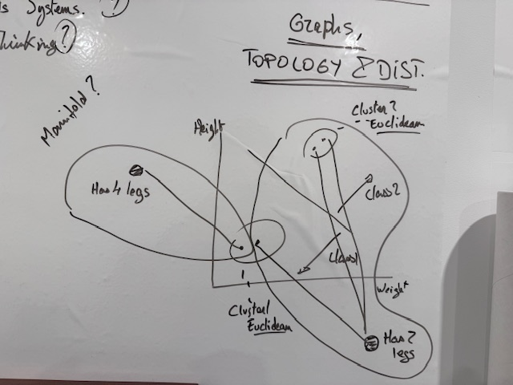
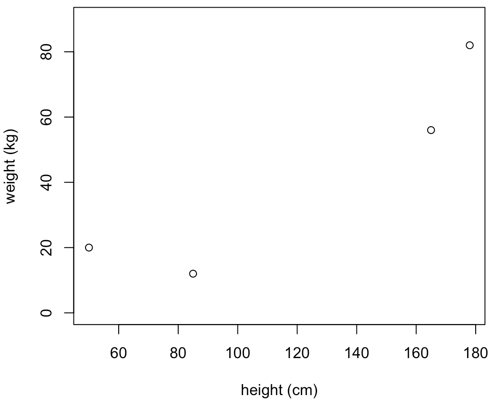
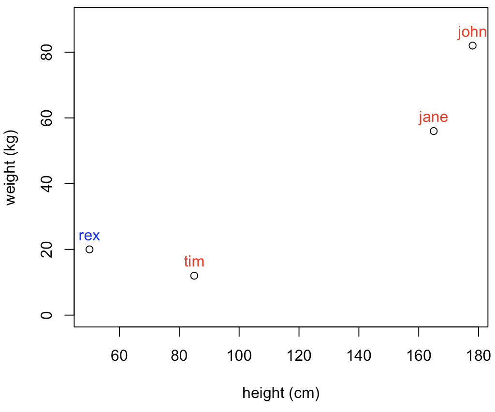
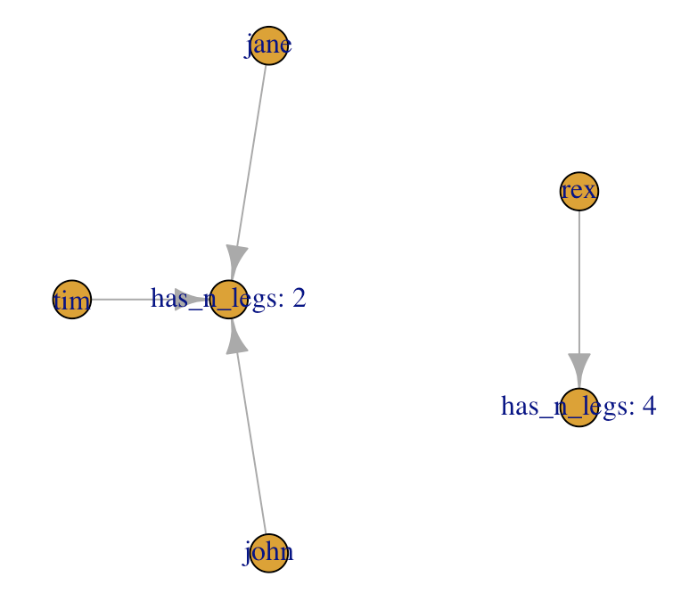
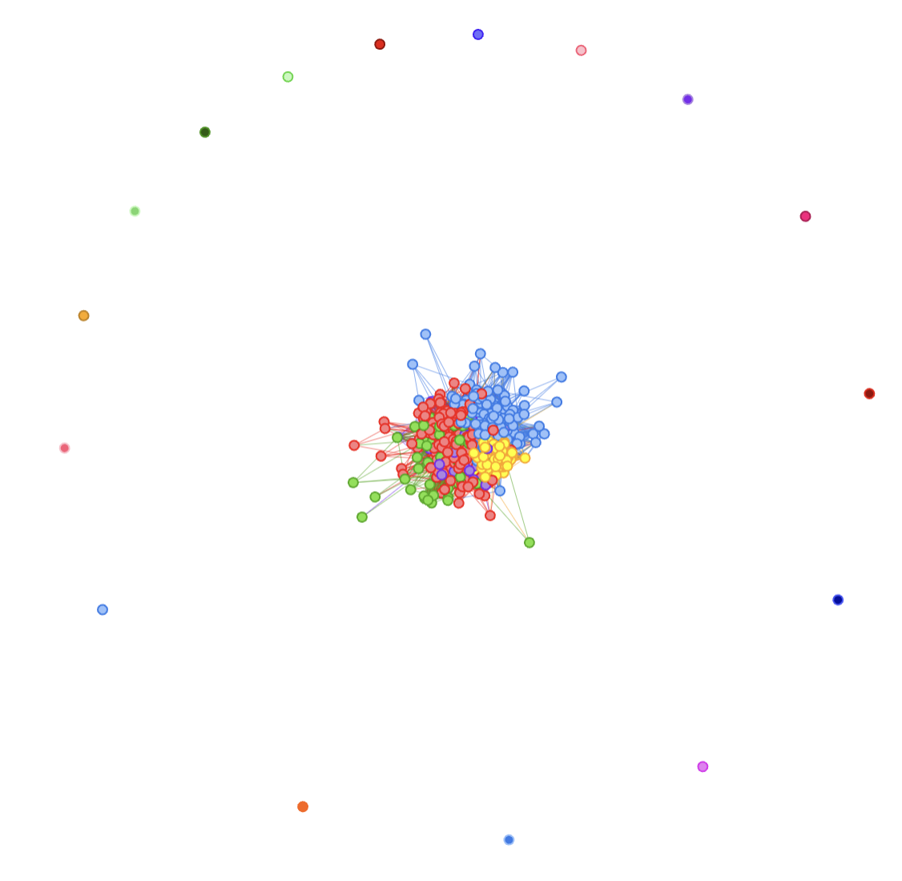
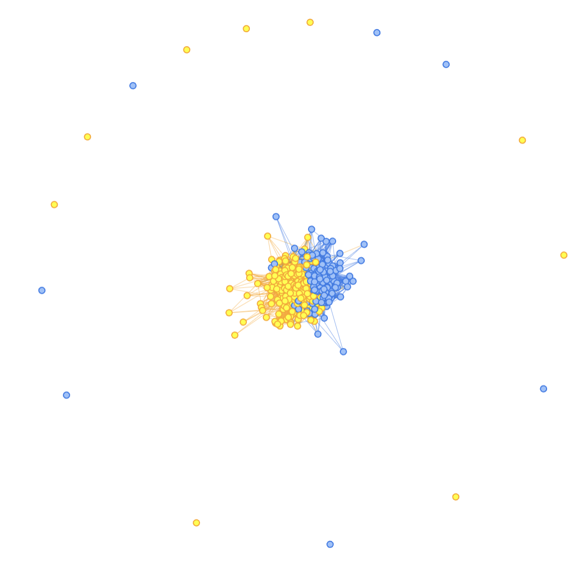
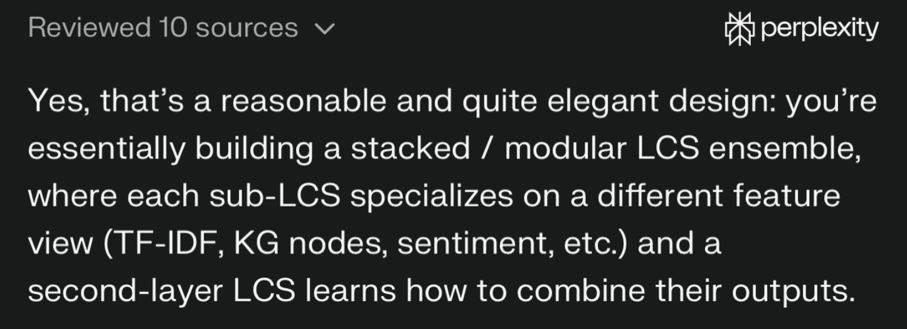

## Looking into other math...

I clearly do NOT know enough about the mathematical field of Topology... And yet, here we are!

But I do have a bit of background about Graphs, and that is related to the whole manifolds, topology ideas...

OK, so here goes, my current (wrong-for-sure) limited understanding on that topic:

-   In topology, distances need not be Euclidean.

-   A graph could more or less be understood as a discretised/compressed version of a surface, a manifold. I consider it as me taking sample points out of the "manifold" and their connections as my graph (although, that's more accurate for planar graphs I guess...)

-   In that approach, "folding", "stretching" does not matter too much because if we consider, say, the distance (e.g. Dijkstra shortest-path) between two nodes in a graph, that is "topologically invariant", and that is cool because all of the sudden, your distances in the n-dimensional space are not affected by changes in scale, new variables, etc. i.e. the distances do not change (they are "invariant")

And that's more or less all I "understood" (and it's probably not greatly interpreted).

## Why is that important?

Topology is a funny field of math, one I know next-to-nothing about (aside from the above and some reading on open vs closed sets..., so yeah: almost nothing).

But I do know that distances are key to Machine Learning (in the case of sub-symbolic ML, anyway). It is true for LLMs and their "embeddings", n-dimensional vectors (usually high n), whereby the LLM learns structure from language and "king-man+woman=queen" (the typical example).

And here we're talking about "distances that do not change"... And that feels like it is an important idea for applications of ML, and even, maybe, explainability...

## One 5am drawing

After reading a bit on the topic of Topology, I came up (literally couldn't go back to sleep) with the above "understanding", and I needed to put it in a visual for my own future reference, the "key" idea behind it (the word "manifold" there is not correct, I believe).

Here goes:



See, it turns out, the LLM "Graph Rag" idea is not crazy to me after all. But without the embeddings (and without the LLM, in fact :D).

So in 2D space, you might have 4 points, axis x could be height, y weight, and you get some dataset like so that you're supposed to use to classify stuff:



If you were to use that to group data, you would probably have two groups, those up-to-the-right, and those down-to-the-left, right?

But what if I did this? (My apologies, I have no idea what kids measure/weight, so that's for sure a horrible data point, but it's made up, and I only mean to make a point...)



The clustering based on the distance here would be... Not great, right? (hint: in my example, Rex is a dog...)

So using distances in this case would be somewhat ungrateful.

## Enters the Ontology!

OK, so what if I had some sort of ontology, being at work on a domain-specific dataset (say human-pets dataset), and now I somehow were able to use that for classification:



With the above in mind... Would we be proposing a different classification?

**MORE IMPORTANTLY**: What if we got many more variables to help us, didn't quite had what we needed to separate the two classes (in this example, that's not realistic, but in NLP scenarios with high dimensional data...?), each variable (sub-symbolic) pushing the datapoints in space in one direction or the other... And needing to learn again the structure with each change...

OK, so this might be a completely wrong understanding of what an Ontology could do to help me here. But I think, that's the basic idea.

We're "tying" our data to a reality, and by the way, I'm using Graphs for just that.

I do not know (almost) anything (yet) about RDF, SHACL or OWL right now, so I'm not at all going into that (I did try to generate an ontology from MITRE ATT&CK data with the help of Copilot about a week back, and it did generate an RDF-compatible thing, I believe, which I actually then transformed into a graph... It was cool! But that's the extent of my experience with that).

Maybe at this point my understanding is more aching to "Knowledge Graph" than Ontology... And yet, I'm using a dimension that might be domain specific and might not be in the data itself, and so I consider I'm talking in fact about domain-specific ontologies here.

Also, I'm already talking about graphs! And by tying stuff to a specific sub-graph, I'm thinking I must not be too far from the concept of projection onto lower-dimensional surfaces that is a "manifold", which would also actually "ground" a decision. Which might have relevant implications (outside of today's exercise, I'm thinking prompt-injection detection by checking "grounding" of answers compared to a domain-specific ontology... Which is why I mentioned it in the first place today :D)

## Interlude: Code thus far

Just for fun:

``` r
demo_df <- data.frame(names=c("rex", "tim", "john", "jane"),
           weights=c(20, 12, 82, 56),
           heights=c(50, 85, 178, 165),
           n_legs = paste("has_n_legs:", c(4, 2, 2, 2)))

plot(demo_df$heights, demo_df$weights,
     xlab="height (cm)",
     ylab="weight (kg)",
     ylim=c(0,90))
text(demo_df$heights, demo_df$weights, demo_df$names, cex=1, pos=3, col=c("blue", "red", "red", "red"))

relations_df <- data.frame(from=demo_df$names,
                           to=demo_df$n_legs)
g <- igraph::graph_from_data_frame(relations_df, directed = TRUE, vertices = c(demo_df$names, unique(demo_df$n_legs)))
plot(g)
```

## Next: Why Graphs, Semi-supervised learning, and getting back to RLCS

OK so I have been having trouble "reducing dimensions" of NLP-related exercises.

One thing I could use to help RLCS is to use clustering of documents.

Here goes: If I can cluster (unsupervised learning) documents, and (hopefully) similar documents (in the same cluster) will fall in the same class (not sure, but hopefully), I could use the cluster ID to gear my RLCS classifier towards the right "niche" and help it greatly in classifying new documents.

If the clusters are one sub-RLCS, or simply a substring of the "state strings", I could encode cluster numbers (and ideally, I could in fact sort them so that cluster numbers orders are related to chosen class), say with a Gray encoding (see many past posts), and so a "small cluster ID" might be tied to class 1, and a "high cluster ID" to class 2, and that would be very helpful to have a very short binary string to encode relevant information.

With the above as context, let me circle back to the idea of Graphs.

In Graph Theory, there is this thing called "community detection", and that can be used to identify clusters in a graph. I won't go into the details of that, plus in igraph it's one-call away anyway (using [Louvain](https://en.wikipedia.org/wiki/Louvain_method) for example). (But the typical example is some Karate dataset... [See here](https://en.wikipedia.org/wiki/Zachary%27s_karate_club) in case you're curious). Again, not the goal to explain that.

As we saw above, topological approaches are potentially valuable because they can be "invariant", and that makes the graph-based clustering approach interesting. Also, it's more "symbolic" than the typical "sub-symbolic" ML, and I like symbolic ML because it's more explainable.

OK, so now I have tested that:

I have [started working with Obama/Trump Tweet posts](https://kaizen-r.github.io/posts/2025-12-14_NLP_RabbitHole/). I will continue with that, but from the Term-Document-Matrix, today I'll focus on getting clusters of "documents" (tweets) from bipartite graphs (document-terms relations).

From the bipartite graph, I'll be using igraph's bipartite_projection(g_bipartite)\$proj2 (which to be quite honest, I don't know what it does!), extract communities with Louvain, and use that to color a graph (visNetwork is cleaner to read, so I'll use that). Let me skip the code for now, and look at the results:



OK, next up, the big question is: **could we use the community (e.g. cluster) to help us identify the class?**

Well, at least for the above example, it looks like a big yes to me:



## Clarification: Not yet put together (at all)

I have discussed 3 things quite separately here:

-   Generated graphs from data and "clustering".

-   And topology.

-   and a bit on ontologies

There is at least one algorithm I keep seeing when I read on the topic, the Topological Data Analysis (TDA) and in our case, **TDA-based Graph analysis**. I have **not** covered any of that today. I just did "link" the idea of invariance and distances in graphs vs euclidean distances (and it's to me already quite important).

Also, linking a data to its ontology is not clear either (as-in: I don't know how I would do that step-by-step) for now. But I seem to be getting somewhere with it.

So yeah, this is all still very much **stuff I need to learn more about**.

Oh well... But it's all very very interesting!

## Conclusions

That was a hell of a trip around the topic, but I wanted to give the background.

I **obviously** did **not** invent the idea of Networks community detection (I wish!) and I'm 200% certain that was being used in the past (pre-LLM, long time ago...).

So I'm not claiming anything here.

However! The idea of adding an ontology (not new either), using graph (based on the idea of "topological invariance"), and using that for clustering (unsupervised learning) to potentially create a reduced dimensional input to feed a supervised learning classifier, that would be explainable, well, that's me alone doing the math "2+2".

And once I came up with the idea, I consulted background documentation (even bought a couple more books...), and yes, I did check my theoretical approach with Perplexity... Before going into coding, I wanted to see if it made sense, in the context of RLCS for NLP in particular... (And of RLCS for RL, but that's a different topic).

At least, Perplexity told me my ideas (these and those of the more recent posts) were "elegant", so...


