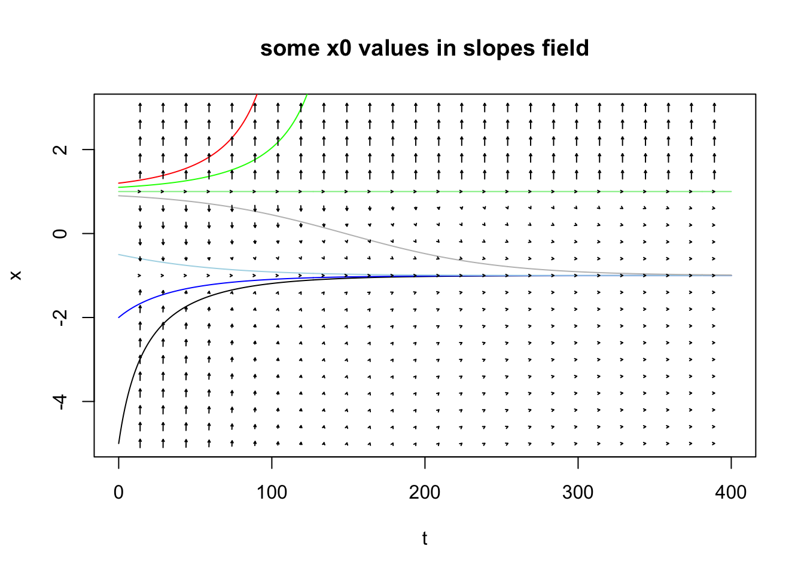
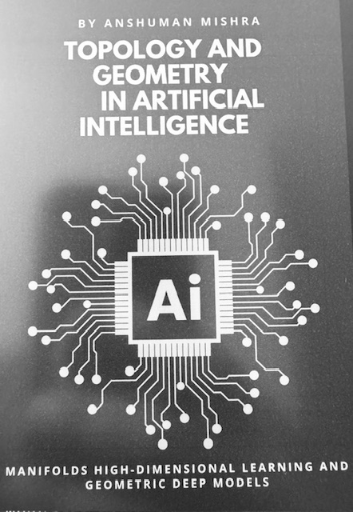
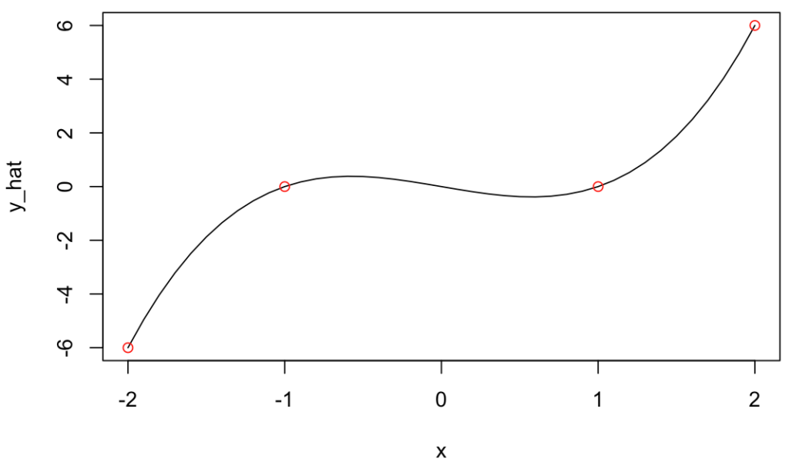

## It's still early in my journey on the topic

I won't pretend I "understand" things here just yet, but when it comes to math, it is important to me to be able to **get an intuition of what things mean**.

I was reading about manifolds. Let me first introduce a few things I read about it, and then mention past background that I think can be related. Because in the past I have looked into ideas that I believe are relevant.

## Basic Manifold understanding

I think the examples for today are quite common, but well just in case, I should mention I read about these in this book:

So a Manifold is a surface. Say a sphere. Say Earth. Earth is curved. But you can do a pretty good approximation of map of a city on a 2D surface.

If you put all 2D city maps (and equivalently "small" country-side maps) next to one another, you can see how "many" maps put together could be stitched into a sphere, right?

So the surface of the sphere is actually the manifold. But locally, you can consider it flat. And on the flat maps, you can use Euclidean distance. But that wouldn't quite work on a 2D map of the Earth, because you'd be missing on the actual distortions imposed by the Sphere.

Well, I think the intuition of a set of maps stitched together is fair enough. Mapping a curved manifold to a local flat Euclidean space is apparently called a Chart. OK.

Then you need the stitching.

## Some "parallel"

When it comes to stitching itself, you come across the idea of Atlas, as they called it. And how to go smoothly from one chart to the next is apparently a "transition map". Interestingly, the book above then immediately introduces the "differentiable manifold" and that's where things "click".

Because these are things you come across when you study numerical methods and the concept of [interpolation](https://kaizen-r.github.io/posts/2024-10-20_Interpolation_Example/) and I would thing mostly of [**Splines** for interpolation](https://en.wikipedia.org/wiki/Spline_(mathematics)) for instance, which is just that: **"a smooth, piecewise polynomial curve defined by control points"**. That's stitching different functions together using something (polynomials) that requires the transitions (at the knots) are differentiable.

Then the concept of tangent space is introduced to help with derivatives and gradients calculations that could work on a differentiable manifold. Tangents and derivatives are tightly related. Gradients (and gradient descent) are related to derivatives (duh!) and useful for optimisation, and clearly so in ML.

But that's not all: The local linear approximations there mentions none other than **vector fields**, which I [touched upon in this past post on ODEs](https://kaizen-r.github.io/posts/2025-07-13_Studying_NonLinear_Dynamics_FirstDay/index.html).

## The Manifold application: My current understanding

So Topology and Manifolds are curious things thus far.

But let's get to the part where I can get some intuition of its application(s). I am reading it has clear applications in Graph Neural Networks, GANs and VAE. Or for an **alternative to PCA** called "**Principal Geodesic Analysis** (PGA)" which kind of makes sense (it's the same as PCA but for Manifolds, non-Euclidean distances).

But the interesting conceptualization for me is that of **the example (in the same book) of all images of faces**.

Take an N-Dimensional space representing "all possible pictures". Maybe let's say all possible pictures in RGB in 1000\*1000 pixels, so the "set of all possible tensors of bytes" thereof.

That's probably huge. **ALL PICTURES, right?**

Now, and **I found this quite intuitive:** Couldn't there be some sort of projection **into a smaller set of dimensions** that covers **all pictures of faces**? Could that be a "surface" that has lower dimensionality, so maybe... a Manifold?

And I find it attractive a concept. So the point would be that Variational Autoencoders (VAE) are in fact learning the corresponding structure of a specific manifold.

And coming back to what motivated me to look into this in the first place: I am interested in all things that **might help me contain dimensionality of input data for classification/RL applications with my RLCS package**, because my implementation of LCS (with binary input strings) suffers a lot with high dimensionality.

Now consider what was said about manifolds, and instead of pictures of faces, maybe think about "all texts about Cybersecurity" within the space of "all texts". If somehow I could "map" the first into a manifold, it seems like I could be **reducing a lot the dimensionality of my input data**.

Oh, and as a reminder, topology & manifolds are in fact quite directly related to graphs. Which I grasp better for now. And **I can use with NLP exercises**, for instance.

OH! And also! From NLP and graphs, the **topic of Ontology comes around**. And now I definitely think there is something here linking all these things somehow. I just don't quite yet understand enough of it all to implement the thing. I **think I'll have to look into TDA** (I am expecting another book I just bought will help with just that!).

But the key point is: **I think I am onto something**.

## Conclusions

Well, not much else than saying that **having an understanding of derivatives and gradients** (and their use in ML for instance), or numerical methods (specifically **interpolation** in this case) and/or ODE to get an introduction on what a **vector field** looks like (or even "means"), **it turns out, will be helpful for me to get an intuition of what a differentiable manifold could mean**. Oh, and graphs theory, which here wasn't mentioned much, but is also relevant!

And I believe, I am **starting** to grasp **a bit of** the general overall concept.

I am so thankful I did learn many of these things along the past few years, and that I took my time (doing an **MSc** over a course of 3 years instead of one) to try and **understand the implications of the math** (instead of hammering formulas but not understanding the underlying concepts).

Names of things in Math can be a bit overwhelming ("geodesics" is not as complex as it sounds, the "shortest path between to points on a manifold", "manifold", "charts" and "atlases" are now somewhat explained above, "Rips Graphs" are not as scary as they sound, and I'm getting into "Riemannian Geometry" next...). But **regardless of the names**, I believe the important thing is the **concept, the intuition**. **Math feels a bit less scary after that**.

Do I have it easy when it comes to reading complicated equations? **Not at all!** But I feel it is in fact less important if it takes me hours to work through systems of equations (I rarely do!) if I know why I'm doing each step...

## Final note

Yes, I know: Many mathematicians out there must be laughing at **how basic my current understanding is of it all**, and that I am "re-inventing" **something that was obvious** to many scientists out there **for a long time**.

You know what? I don't know about others, and **I can't allow myself to care about how little I know. I am just happy to move forward and improve.** That's the best I can do.

I am sorry however it took me so long to "discover" all this, so late in my life. I wish I could have appreciated all of this when I was in my 20s. I didn't. Nothing I can do about that. I do now, and it is very very (very!) satisfying to see all of this unfolding in front of me (not without some effort on my part, mind you :D).
