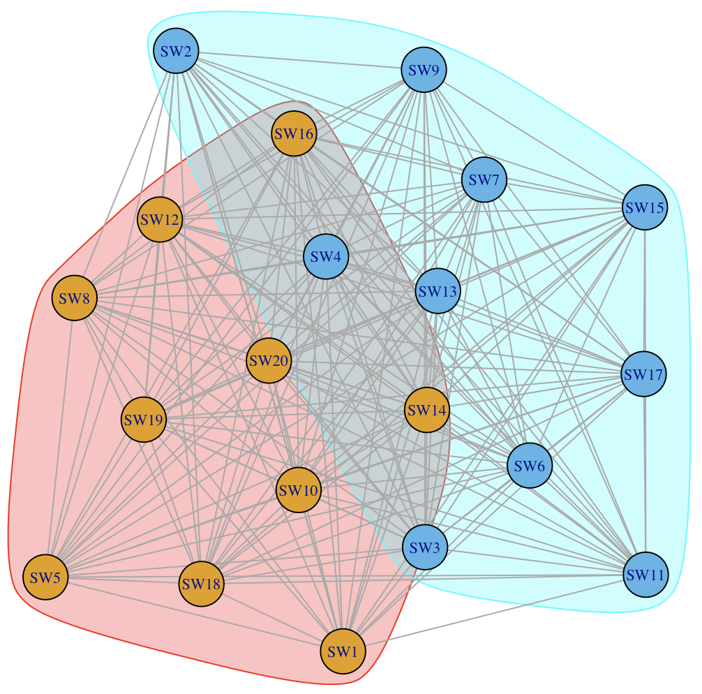
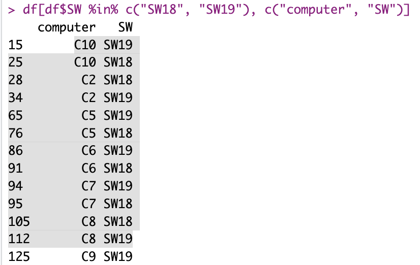

## Application of Bipartite Graphs

Suppose you have a difficulty at work with an IT Inventory, a somewhat simple one in theory:

-   *Say you have N tools to report software per machine (to ensure coverage you probably would use more than one, as maybe not all tools report on all machines: maybe some work with Linux, other focus on AD, some tool focuses on clients, another on servers...).*

-   *Moreover say (and it is a real problem, from experience!) each tool reports a slightly different name per Software (you wish all software inventory tools used CPE, but... Well, the real world is not perfect I guess).*

So what if you wanted to look for a given software across your IT inventory? Which "name" would be the right one to search for. Actually, wouldn't you like better to be able to fuzzy search and match (where possible) across all detected names for a given Software?

Well, today we're going to do just that!

## Bipartite graphs and projections

Last week I mentioned this (in a different exercise):

*"bipartite_projection(g_bipartite)\$proj2 (which to be quite honest, I don’t know what it does!), extract communities with Louvain, and use that to color a graph"*

To be quite honest, that's the kind of things that bug me. The things that work but I don't know exactly why, I mean. So I looked into it.

It turns out it's pretty simple in this case:

Bipartite projection here refers to grouping one side of the bipartite graph by (simply) linking with an edge all nodes (say, documents) that share a node on the other side (say, terms/words).

That's it. I am guessing variations of this for stronger relationship would use a threshold and only link documents that share a minimum amount of terms, but no matter. That was in the scenario of documents.

Today, we're going to use this very exact with computer names and software names.

## The application

Take two software scanning tools, that run scans of two mostly overlapping subset of computers.

You'd hope, at least for all machines that overlap exactly, that at least a good part of the overlap would be identical software.

Imagine you extract that info (from a database) whereby you get all computers that appear in two of your scanning tools.

Also, you could first go the group computers that share the same software name entries, so that you could cluster those using say community detection. (In a real world scenario, the softwares would be correctly grouped, not like the demo below.)

For each one of the clusters, you then group the software names by appearing in same computers, using the bipartite projection proposed above.

What you would (ideally) end up with is a graph where two nodes (software names) are linked if and only if they appear in the same computers.

So now you'd hopefully have a rather reduced set of software names that are shared per groups of computers, from two different scanning tools. Some of those would be the exact same name and so have no issue (but you'd remove those in the initial query to your database, because those don't matter for the exercise). Most of the rest then should be easy to match and reduce to one software name (again, hopefully), if you take a size-able sample of your (large) environment. And maybe for the reduced subset, as you in theory "know" all software appear in pairs on the same computers, you could possibly check for most similar names using maybe some version of the Levenshtein distance.

And voilà!

(Note: The community detection part is not as useful on a randomized demo dataset...)

## Demo

I'll keep [the code for today](https://github.com/kaizen-R/DF2GRAPH/blob/main/demos/bipartite_projections_demo.R) alongside my project for "Data frame to graph", although this one is slightly different from the original idea, but it does illustrate some value of doing graphs in the first place :).

Now here goes the actual results.

``` r
## Some demo data
df <- data.frame(
  computer = sample(paste0("C", 1:10), 200, replace = T),
  SW = sample(paste0("SW", 1:20), 200, replace = T)
)
df <- df[order(df$computer),] |> dplyr::distinct()
```

For some sample data where there are 20 software used across 10 machines, we could try to find all software that are reported together across the same machines, and to do so we could find "neighbours" in a projection of a bipartite graph, as explained above.



Now remember, in our real-world scenario, we wouldn't have random data! So the groups would be much better separated. (And we'd have a lot more groups, with a much larger dataset...)



Well, this definitely seems to work. :)

## Conclusions

This is **not** a purely theoretical exercise. I know for a fact this is an actual need.

And with some more work and iterations, you could reduce the lists of software names into dictionaries. Which in turn you could use to help find software in your IT Inventory.

What I'm talking about today is actually **a tool to standardize software names**, those reported by your different tools scanning for software inventory.

And I know **understand just fine** what the "igraph::bipartite_projection()" actually does. And in trying to understand it I could come up with a real use-case.

Remember: **Automating code production using an LLM without curiosity and tension/work is possible today, yes; but you wouldn't come up with as many ideas**.

The famous quote "**Inspiration exists, but it has to find you working**" (or some other version of that sentence, I have found it in books in the past but can't remember it exactly) is attributed to Pablo Picasso. I tend to agree with it :)
