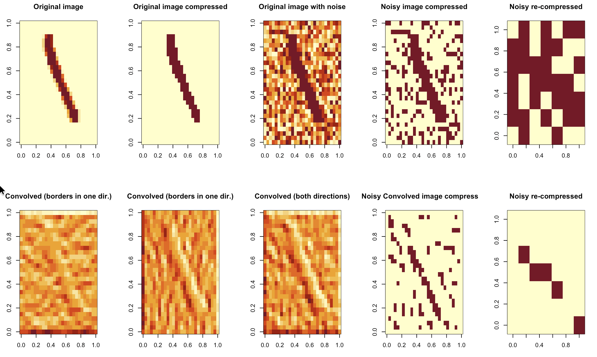
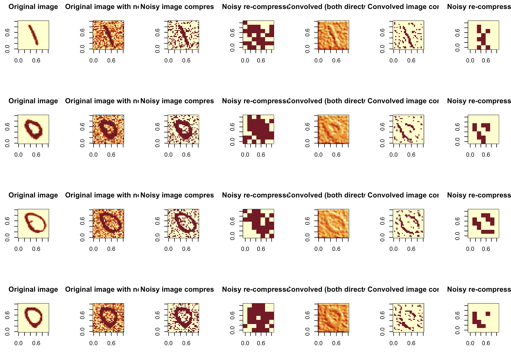

## I was reading "Perceptrons"

While reading Minsky's & Papert's "Perceptrons", which discusses geometry and learning, I was reminded that I still did not quite understand convolutions.

And these are very useful for images processing.

And then I thought, maybe I should learn a bit more about it for my images classifier with RLCS?

## Adding Noise and extracting compressed data

As it turns out, my current (simplistic indeed) implementation to compress MNIST images is quite straightforward:

From a 28\*28 matrix of pixels with 256 intensity:

-   I make these binary by filtering on a threshold (e.g. if pixel value is above 128, say, I set it to 1, 0 otherwise)

-   I take 4\*4 square (totaling 49 squares) out of the picture and if any bit is set to 1 after the above step, I set the whole square (as a new bit) to 1, otherwise 0, in a new 7\*7 pixels matrix.

That way I could use shorter binary strings and train RLCS on that. It worked nicely.

But what if I added noise to the MNIST pictures?

It turns out the above algorithm would compress pictures while keeping too much noise. (see first row below)



As we will see next, we can do better.

## Convolution before compression

So a convolution is all about comparing neighbouring pixels, in this context, and highlighting the ones that are contrasting. To do so you "slide" a matrix (kernel) over your pixels in a small region (I understand typically 3\*3), that looks for rapid changes in pixel intensity, by computing weighted sums of the pixels whereby the result is small if the pixels are mostly similar, large otherwise.

You can detect like this vertical and horizontal edges. You would use two different kernels, and in this case I used the (apparently "standard") Sober kernels for the purpose.

``` r
# Example 3×3 Sobel vertical & horizontal edge detector
Kx <- matrix(c(-1,  0,  1,
               -2,  0,  2,
               -1,  0,  1), 3, 3, byrow = TRUE)
Ky <- matrix(c(-1,  -2,  -1,
               -0,  0,  0,
               1, 2,  1), 3, 3, byrow = TRUE)
```

Once I had a basic intuition on the approach, I asked Perplexity (yes, as this was just for me to try to understand something... I'm not proud though, but I'm short on time lately :S) to give me the code for a function that would do 2D convolution of a matrix of pixels, which returned this (although there are libraries in R to do this... But I wanted to follow along):

``` r
## NEW: Make sharper images using convolutions, before compressing
conv2d <- function(X, K) {
  # Sizes
  h <- nrow(X)
  w <- ncol(X)
  kh <- nrow(K)
  kw <- ncol(K)

  # Half‑sizes for centering the kernel
  kh2 <- kh %/% 2
  kw2 <- kw %/% 2

  # Output matrix (same size)
  Y <- matrix(0, h, w)

  for (i in 1:h) {
    for (j in 1:w) {
      acc <- 0
      for (ki in 1:kh) {
        for (kj in 1:kw) {
          # Compute offset position in the input
          ii <- i + (ki - kh2 - 1)   # -1 because indices start at 1
          jj <- j + (kj - kw2 - 1)

          # If inside the image, accumulate weighted value
          if (ii >= 1 && ii <= h && jj >= 1 && jj <= w) {
            acc <- acc + X[ii, jj] * K[ki, kj]
          }
        }
      }
      Y[i, j] <- acc
    }
  }

  Y
}
```

And the second row in the picture above shows the effect of each kernel, the sum of both kernels being applied, and then a compression as before (that in this case could use both very high and very low thresholds, but that wasn't necessary), all of it resulting in a compressed signal at the very bottom-right picture for this approach. (In case you wonder, the rest of my code for today, from reading MNIST pictures to compression and such, was typed by yours truly, not by an LLM...)

## Sampling some more

I have played a bit with thresholds, amounts of noise, etc, and then settled on some values that gave me somewhat satisfactory results for my exercise.



It appears to be helpful.

## Conclusions

Simple clean pictures can be classified rather good with RLCS. But today I showed that maybe for noisy pictures, I should add a level of pre-processing in order for my classifier to work.

And from a few tests & samples I've run, it seems like this approach does make some sense.

I won't say this is the best approach, but it does seem to bring some value to encode pictures that, in this case, could be noisy.

And hey, if it's good for NeuralNet for classifying pictures, I don't see how it would hurt my RLCS classifier :)

## Side note

I am aware the book "Perceptrons", at least the edition I'm reading, is "as old as 1988". Well, I don't mind, I am liking it very much. It's actually helping me grasp a bit better some concepts of topology, which underlying math is a proving difficult to follow in some other resources... :D
