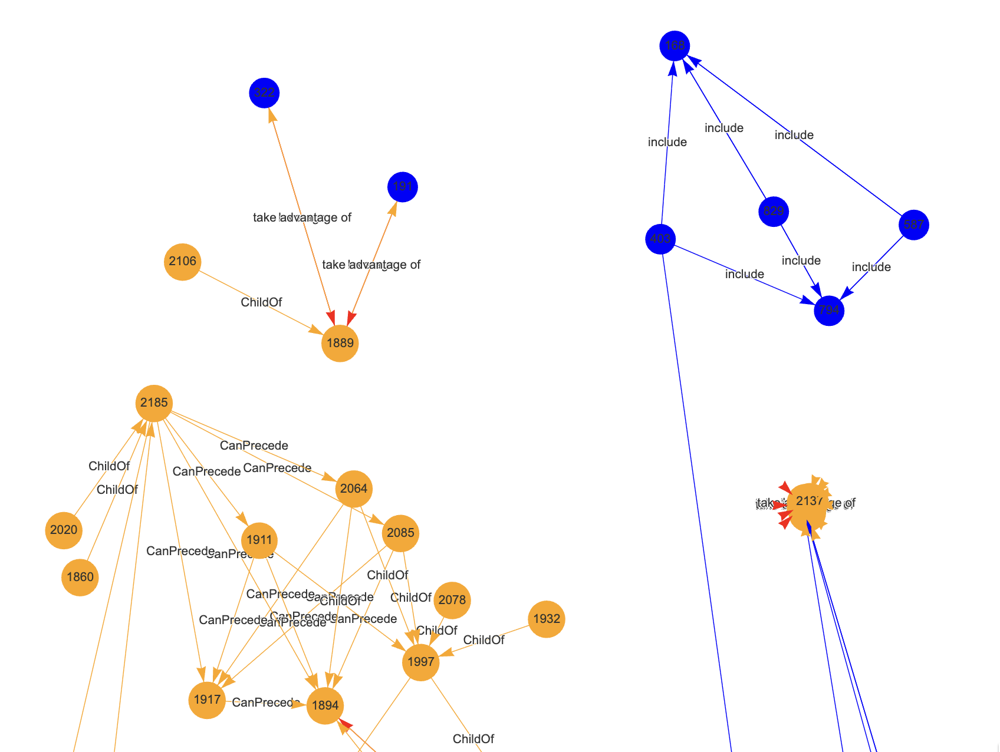

## Back to roots

I've been talking a bit about rather uncommon stuff such as ontologies, topology... But it all has a background idea: to do ML and NLP without necessarily using Neural Networks. Or LLMs.

One thing I keep coming back to, to manage the complexity of Natural Language data encoding is to use Ontologies so as to help a classifier, down the road, to work on categories and topics and such to do its job, instead of (or rather "on top of") using the text itself (be it through vector databases or terms-documents approaches).

I see the Ontology idea (more so than a Knowledge Graph) as a way to "ground" a text to underlying topics and concepts, which seems like a good idea overall. I like the parallel of that with our own minds: When someone says "banana", we immediately have a mental image for that. And it ties, for all of us, by default, to "yellow", "fruit"...

Well, that's why I believe Ontologies are a nice idea. Although categorization seems like a hugely difficult task, as you could think of banana as also "brown", or "green", or "grows on islands", or... Well, it's not so clear to me how long the list should be, really... And if you know a lot on the topic, your list would be longer than mine... Also, the moment you think "yellow", you can think "color", which is another way of categorizing bananas versus, IDK, strawberries. And so on and so forth...

So where you put the limit is a difficult topic. But I'll try to be practical for now.

And I'll focus on one of my other main areas of interest (besides data and ML): Cybersecurity. Well, cybersecurity data, I guess. And ML applied to Cybersecurity... :D

But let's move on.

## Building a reference for Cybersecurity texts...

So let's say I want to "ground" my texts, with regards to Cybersecurity topics. Same as with the banana, I could create categories and categories of categories and so on and so forth.

Free text of any topic would include not one "idea" such as banana, but possibly a huge list of them. Cybersecurity texts could discuss conferences, threat intelligence, infections, firewalls, SIEM, SAST, ... Heck I'm not sure I can put down on paper a list of topics.

So instead, I should use references. Take your pick, you get to choose: NIST, OWASP, MITRE... And these are only one way to go... You could choose vendors blogs, Reddit, etc. Anyhow.

So I'll pick one for now, say [Mitre ATT&CK](https://attack.mitre.org/). Because it kind of is already neatly organized, which is very suitable for me.

A few weeks back, at work, I used an LLM to help me put together an Ontology-generator of sorts for "Tactics & Techniques". In fact thanks to the genAI I ended up with functional (but not reviewed) code to generate an RDF file. And then I used that to generate a Graph. And all in Python (because well, R is in some contexts not the best option). Anyhow.

Today I wanted to see what I can do without any LLM. So can I take Mitre ATT&CK and put it into a Graph?

## The thing you should always do...

I was about to start coding a tailored crawler of sorts, but then, "light-bulb"...

Check if someone already did it! And surely enough, I found [this package](https://cran.r-project.org/web/packages/mitre/readme/README.html) which was, indeed, perfectly on point.

So I got started (and that's all I have time for this morning), and it all fits in this short snippet of code:

``` r
library(mitre)
library(RLCS) ## not for today, but hints at the future: I'll want to use Mitre data for...

View(mitre:::attck.techniques) ## Cool, datasets directly here, no crawling needed!
View(mitre:::attck.groups)
View(mitre:::attck.relations) ## AND ready for Graphs generations!


g <- mitre::build_network() ## That was easy!
# plot(g) ## Unreadble, understandably so.
visNetwork::visIgraph(g) ## Easier to work with visually, as interactive...

library(DF2GRAPH) ## Maybe I can use that -my own- to leverage differently the datasets in the mitre package...
g_sub_mitre <- df_to_graph(mitre:::attck.techniques[sample(1:nrow(mitre:::attck.techniques), 100), c("type", "name")])
plot(g_sub_mitre)
```

That was... Easy!

Also: When using third party libraries, one needs to worry about trust. But this is a CRAN package, and Hadley, no less, is a contributor. That's a positive signal for me :D

## Results

Just so that we have a visual component in this Blog entry, the mitre package graph generator is pretty cool, here with a layer of visNetwork on top:



Now that is not exactly what I need, but it's definitely a great start! I can definitely use this as a starting block.

## Conclusions

So here it is: I'm hopeful I can use some database, possibly in graph format, to tie texts to concepts. If an "ontology" allows me to tie certain keywords to certain "categories", I could then possibly use the categories to supplement with new "features" a text classifier, helping it separate texts not so much on word-by-word (high-dimensional issue) but maybe on smaller, neatly grouped, categories.

And maybe then in a future, I can use such an Ontology (or something akin' to it) to support an explainable model, based (of course) on RLCS, whereby I could tell you "this text is important because it ties to this and that category", instead of (that already kinda works) "it contains keyword X and does not contain keyword Y".

More importantly, if I can put together subsets of signals, such as TDM for one submodel, ontology-tied categories in another, maybe sentiment-analysis in another, and so on and so forth, and then have a "meta-model" (an idea I've discussed at length a few times), I'd be "stacking" different classifiers and putting together a (somewhat complex) model that could tell me:

"This text is classified as important because it doesn't mention X, but it ties to category Z of your ontology, and also it's negative in sentiment, and the text structure is short and it was published in that source".

Hopefully that's better than "Text is classified as important because *magic*".

And maybe more importantly: Not being LLM-based, if you use an explainable model **alongside** an LLM, maybe you can reduce the issue of hallucinations or topic drifting...? (That's one possible underlying motivation for the whole concept).

TBC.
