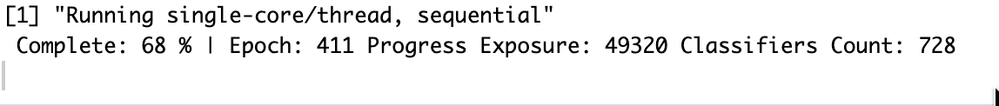
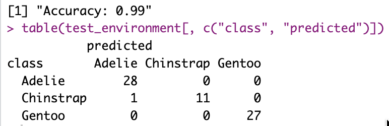
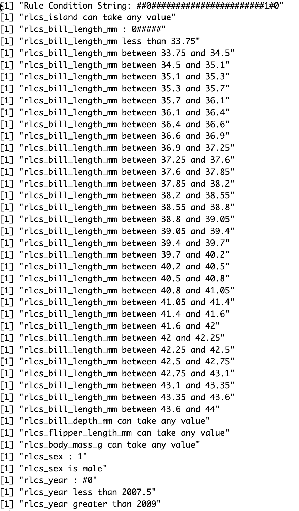
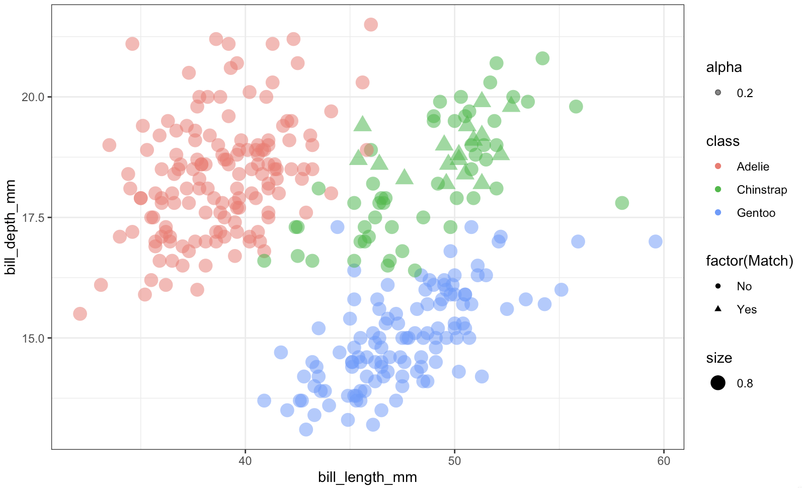

## While thinking about other things, small improvements

The RLCS package now can take factors as input variables. It helps, because it's not always numerical values. Although factors can in fact be encoded as numbers (as done in R), there is no real "order" to them. But that issue aside, it can be done.

Then all you need is to be able to decode it.

Considering more variables (i.e. features) hopefully is of value for classification power (i.e. it should be, unless covariance, co-linearity, or simply put, two features are highly correlated...).

So I'm thinking about other stuff, but I should keep making RLCS better in one way or another.

## Progress bar of sorts

I was never happy with how, because RLCS is rather slow to train a model, the user UX was not great in terms of feedback, showing a new line every certain number of epochs or so... It felt bad.

So a minor change is this:

This simply shows percentage progress with each epoch, but without creating new lines, so the "user-experience" is slightly cleaner. Nothing world-shattering, fair enough...

## Factors as input, and decoding

I needed a dataset to play with that would include factors. MNIST and Iris weren't it. So I went with the Penguins dataset. It was actually included as a demo in a recent past commit of the RLCS package, but I missed the decoding part, the RLCS Rosetta Stone function update to make it a bit more readable.

After all, RLCS is about explainability, so it should make decisions readable, right?

Here a few screenshots to get a sense of it.

Overall, this is a rather small detail in the grand scheme of things, and yet it makes RLCS slightly better. Which is already a good thing.

## Musings

A few questions occupy me lately.

-   **What is "PhD-Worthy" work?** I tend to at best put together stuff, which could be **considered more engineering than research**, for sure. A PhD requires that one brings something novel. It can be small, very niche, as long as it pushes things forward. On top of publishing and whatever else non-sense. The research is what interests me, I guess.

-   Knowledge representation has been central to my thoughts recently. Ontologies keep coming up somehow, but I feel there is much more to it. Data encoding, compression, representation... Mathematical, geometrical, symbolic...

-   I still have a focus in cybersecurity data, although it sometimes doesn't show in this Blog. But it's still very much a central topic for me.

-   In Reinforcement Learning, I'm rather curious about "knowledge transfer", or how something learnt in one "world" could be used as pre-training for another "world". See, most RL exercises (AFAIK) are very domain specific: They work in one game, but need complete re-training to work in another. Maybe by adding some translation layer in between perception and inference, after making sure each signal from each sensor is separated...? IDK.

-   About the last point above: We humans have the capacity to make mental models of things such that past knowledge or experience in one area can be leveraged as supplementary data in different context. We make comparisons, and analogies... It gets fuzzy fast... But I think it still has a lot to do with credit assignment, and multi-sensorial experience... I just don't know what to make of it yet. But it sure is interesting.

So those are my thoughts, along with trying to not completely forget what little of German I know (that's not going good, but at least I'm trying), reviewing the CISSP study guide (I still don't know whether I will try to take the exam or not), and worrying about misuse of genAI overall (and what to do / how to go about it), all that to make sure I am not bored, I guess.

And overall trying to settle on one big-enough idea to work on, instead of a myriad of smaller interests I may have. Something worthy of a few years of focus (RLCS being the last such example, but in and of itself it's just an implementation of someone else's algorithm. And yet I've been at it for about 1.5 years now...).

## Conclusions

I feel like I **read more** and **do less** lately. So making small progress with RLCS, or looking into Graphs, or MITRE ATT&CK, or whatever in a more **practical** manner is more something to re-assure myself that I make small tangible progress overall.

But I like reading and thinking. I just somehow feel... Guilty if I don't post here or code something over 2 or 3 weeks, small as it may be. And it's a problem I created for myself that nobody else cares about, I know...

But as "problems" go, this one at least makes me minimally productive. Slow & steady, better than none, I guess.
