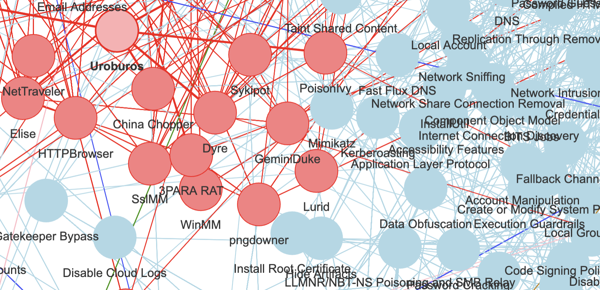
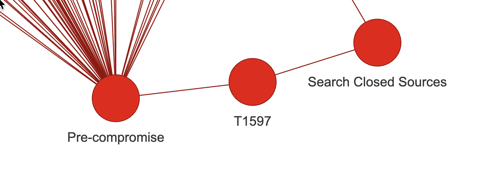
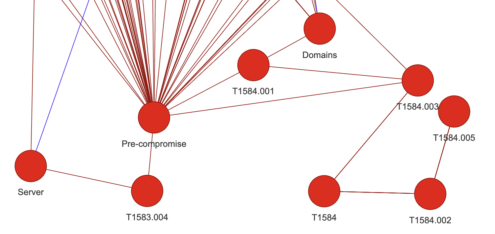
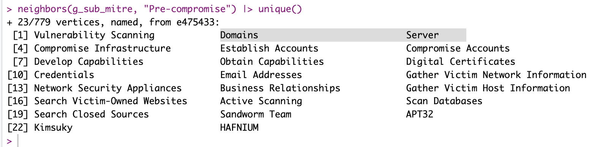
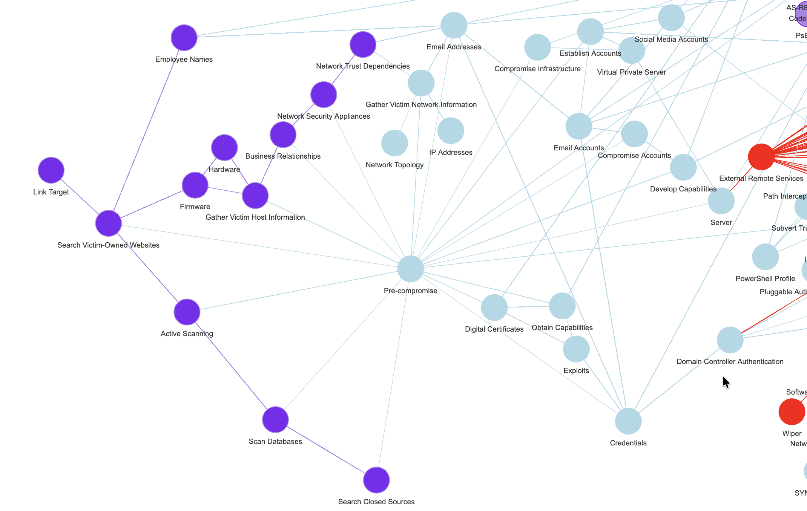

## Continuing...

A few weeks back, I showed real quick what the R "mitre" package could do. See [here](https://kaizen-r.github.io/posts/2026-04-25_OnMitre/).

Now that visual from the package is impressive, but not readable as-is, and also, not very useful if I mean to try and somehow "link it" to real Cybersecurity news.

So I thought I'd give it another spin, as I still very much think a knowledge graph of sorts, taxonomy (with alt-text) and/or (ideally in some more distant future) an actual Ontology, any of it would help with adding semantics to free-text cyber-news. And then these semantic concepts in turn would help control dimensionality, with minimal loss of relevant information (in an ideal world).

To be clear: This is quite exactly what people do when they do "Graph RAG" in an LLM context. But ontologies and NER and taxonomies and all that have been around for quite some time. Definitely more than ChatGPT...



## OK so: Mitre ATT&CK, take 2

In the last post on the topic, the visuals, coming from the original **mitre package**, used codes and identifiers for nodes names. That's not ideal for what I have in mind.

So I thought, I would try to replicate the work, but use the nodes names. In many a case, it seems better (you'll see as we go).

## Missing Graph operation?

Now the mitre package includes all relevant data but links nodes by identifiers. If I use my little package "DF2GRAPH" directly on these tables, I face a rather obvious problem. Something like so:



But see, for linking concepts to free text, I don't expect many Bleeping Computer news to contain "T1597" in them... So that's not very useful.

I want to do one thing:

-   Remove nodes

-   BUT keep their neighborhood linked

And it turns out, I couldn't find that functionality within igraph!

Not, at least, as I just simply described right above. You can generate subgraphs for instance, removing nodes for instance, but that removes as well the corresponding edges.

However, what I aim for is, e.g. in the above screenshot: keep the relation between "pre-compromise" and "search closed sources", just remove the node in between.

Well, AFAIK right now, that wasn't a native functionality.

So I coded me-self a short function, really really simplistic (for now, as long as it works...):

``` r
remove_vertex_keep_neighborhood <- function(g, vid) {
## ASSUMING igraph is loaded, of course...
  t_neighbors <- neighbors(g, vid)
  while(length(t_neighbors) > 1) {
    for(i in 1:(length(t_neighbors)-1)) {
      g <- add_edges(g, c(t_neighbors[i]$id, t_neighbors[i+1]$id))
    }
    t_neighbors <- t_neighbors[2:length(t_neighbors)]
  }
  
  g <- delete_vertices(g, vid)
  g
}
```

Pretty straightforward, I guess. Anyhow, that helps, let's see how.

(One issue here remains: You can easily end-up with duplicate edges, I'll get to that next, but it's not an awful problem for understanding the concept.)

## Output for this session

So before my little exercise for today, I could "df-to-graph" my way from Mitre ATT&CK data quite nicely, using relations of different things and concepts, but it would keep all identifiers of things.

And so it would look a bit like so:



Here you can see how there are too many nodes that I wouldn't quite know how to use.

But after calling my little removal function on all TXXXX(.XXX) nodes, for instance, things get slightly cleaner:



Now "Domains" and "Servers", both that were linked to "Pre-compromise" through TT identifiers, are directly linked to the node as I wished.

## Resulting graph

Iterating over all such nodes that I don't like, removing them one-by-one, things look muuuuuch better:



(You'll notice the colours, don't worry about them, they are coming from a Louvain clustering (community detection) algorithm, as I've already used in the past.)

## Conclusion

Does Mitre ATT&CK data not look a bit better now?

What if, say, I could find mentions of "Email Addresses" (or some alternate name for that concept, using a taxonomy say), in a news article? Would that not link (potentially!) to a pre-compromise concept in the attached graph?

What if I find things like mentions of some APT group or bad actor...? The same could apply. (See first screenshot for today :))

Could I gather such (few) key **meta-concepts of sorts**, and try to find references to these in texts (with, definitely, **some effort**)?

Well, if I could, I would use that to give some simpler concept to the texts, that I could use (on top of other approaches, I think "stacking" will be very necessary still...). And I would use that information to help train my model(s).

Just as a Graph RAG approach would do for an LLM. But with no hallucination (I'm not using an LLM or thinking much about using any). If anything, I'm thinking of this whole thing as an alternative, supplementary check alongside LLMs... As a separate check of sorts.

On the other hand... It does feel like **creating a relevant Cybersecurity Ontology will require a lot of effort**. And before I even consider that (assuming, which surely is wrong, there isn't something already done out there), I need to test a bit the ideas I just mentioned. But, **if it works**, then it might be valuable for me to invest a bit of time with this whole ontology thing.
