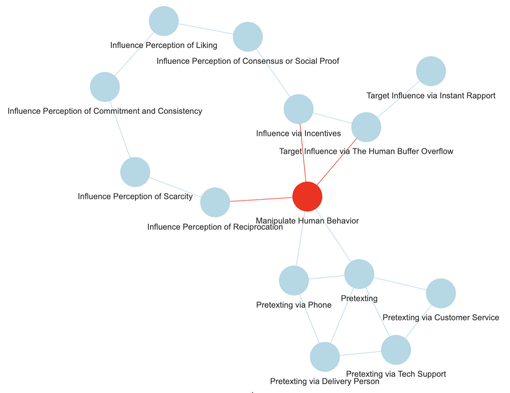
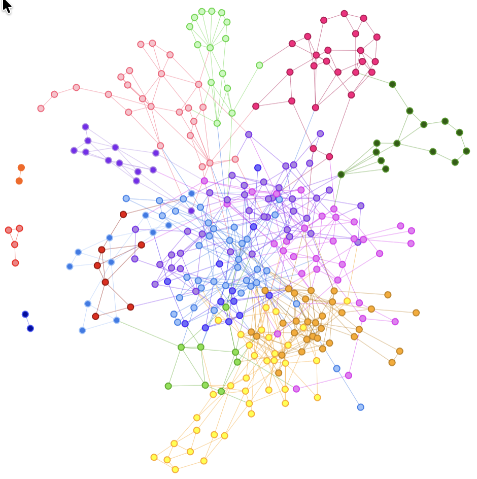
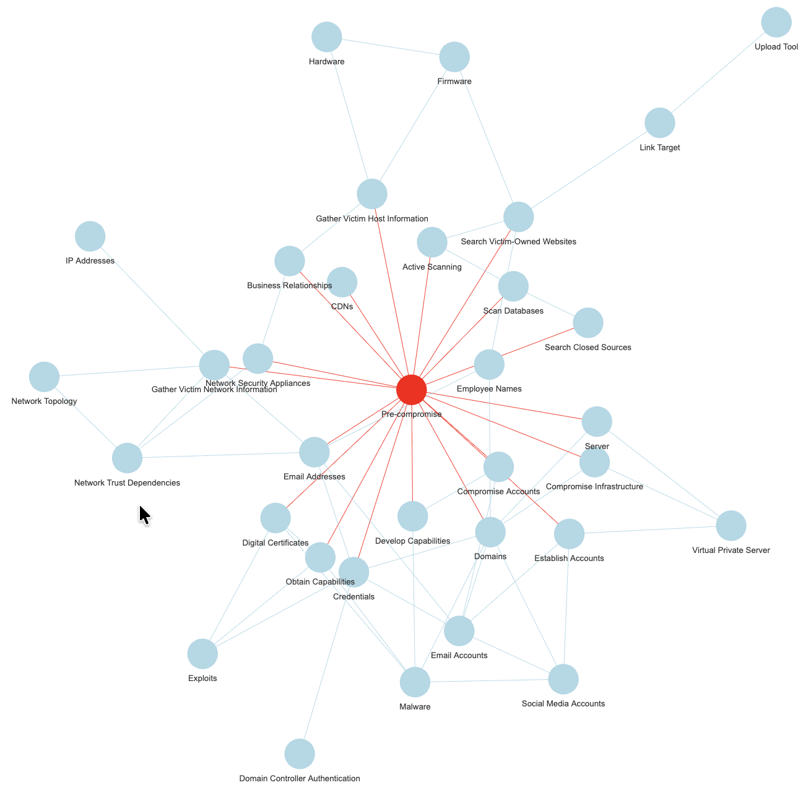
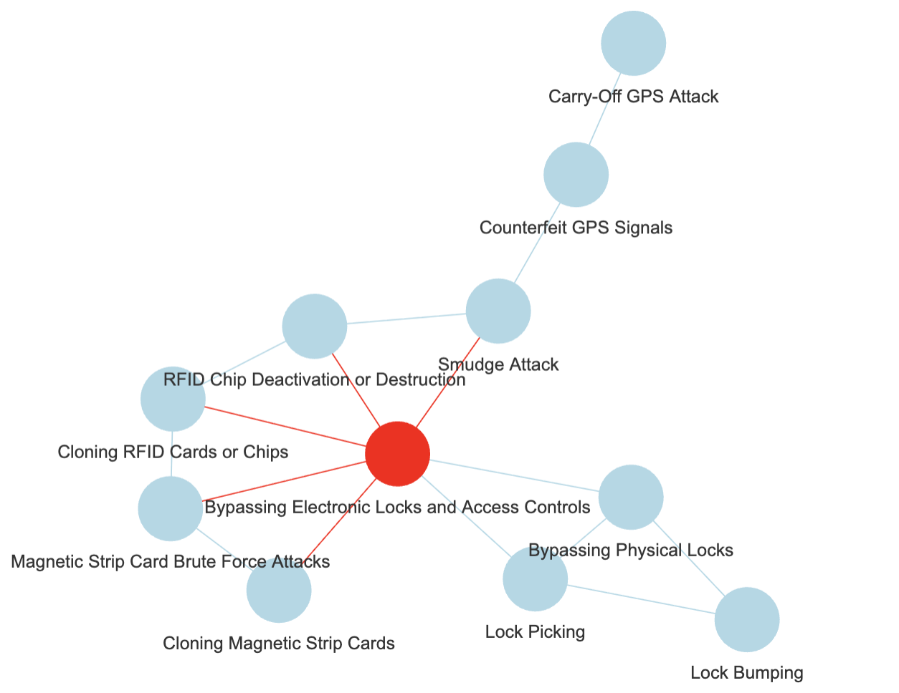
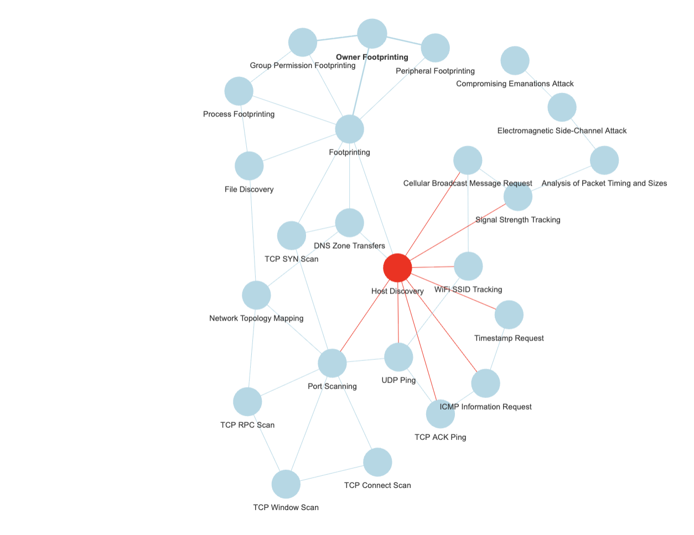
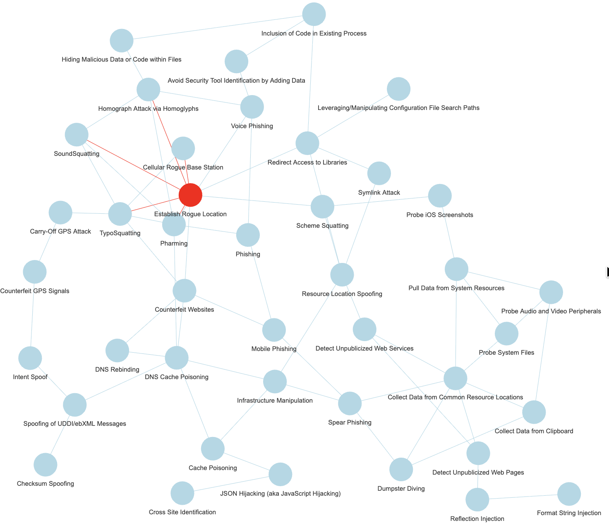
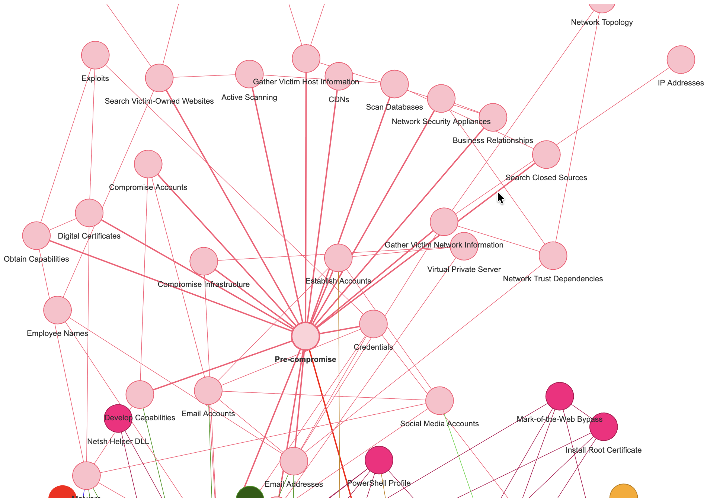

## And it goes on...

I've shown a couple of days back how one could go from Mitre ATT&CK data to a **knowledge graph** ("KG" from here on) of sorts.

But there was a reason for it: I'd like to use such a KG to identify key concepts out of free texts on the same cybersecurity overall topic.

So **how to you go from one KG to its key concepts?**

## Graph Theory to the rescue

### Step 1: Community Detection

I've done it a couple of times, but it's worth remembering here.

Community Detection in graph theory is "simply" about identifying groups of nodes that, based on structural properties, essentially "clump together" (or "cluster") more than with other nodes. This is in essence what the name implies: Find communities of nodes.

If the above reminds you of k-means clustering, say, well, it's because... It is about doing something similar after all.

And there are a few algorithms out there for just that. I've been using Louvain for coloring nodes in graphs in recent posts.

I will not go into details here, although one concept is worth mentioning about it, called "modularity", if you fancy studying the theory further.

In clustering things, you get different subgroups of nodes, each group a cluster or community, as extracted from the network own structure.

In a perfect world, you big network of nodes can then be broken into smaller sub-networks, one per community, and if all goes as planned, each community loosely will correspond to some key topics and related nodes.

Next, we need to extract the key topic of each community...

### Step 2: Vertex Centrality

Well, again, Graphs theory.

We're now focusing on one **sub-graph**, as induced by all nodes tagged as belonging to one community (and all edges among them that existed in the original bigger graph).

You have a list of vertices (aka nodes). Each one in you graph, linked to one or more other vertices (unless the induced subgraph is in fact an isolated node, but these are of less interest...), each one with some properties.

One easy one to understand is the vertex "degree": Simply count the number of edges connecting to the vertex (and if the graph is directed, there are outbound and inbound edges... And multi-edges could make things more interesting. But that's beyond the point).

What if you sorted your list of vertices by decreasing degree? So the first vertex would be the one with most connections, the last with the fewest connections.

In a graph, would you say a node that is connecting to all other nodes (for example) is more central than a node that only connects the first one? That's one measure of centrality.

There are a few other measures.

-   Betweenness centrality leverages shortest paths on the network (how to best connect any two nodes), and then considers the impact of removing a node on said paths. The more important the node as per that information, the higher its betweenness.

-   Eigenvector-centrality uses properties of the adjacency matrix representing the graph.

-   ...

History bit: In case you were not aware, one now well known algorithm, actually derived from Eigenvector centrality, is Google's "PageRank", which powered (at least back in the day) Google's search engine at the beginning and was at the origin of that company's success in competing in the search engine industry...

## Results: Putting it all together

Let's just see a few options of different clustering algorithms and different centrality measures, and how it actually seems to kind-a work correctly...

For the above for instance, I used Louvain with a resolution modifier (identified more clusters), and then betweenness centrality, out of my ATT&CK graph.

But there are other datasets to be used, the next few entries are derived from the exact same exercise from the Mitre CAPEC dataset (simplified):

And one can test various combinations of clustering and centrality, why not:

### Side note: Mitre CAPEC

You keep hearing about ATT&CK, but there are other data sets from Mitre than come bundled with the R package "mitre".

The "Common Attack Pattern Enumerations and Classifications" is one of them, and by the way in the R package, relations are included to the related "Common Weakness Enumeration" entries, but also some OWASP Attacks, and CVE examples. I took for today only a subset of said CAPEC data.

And yet another dataset from Mitre is included, one derived from the SHIELD knowledge base, although to be honest, I haven't dug into that just yet. Maybe some other time.

## Why it matters?

Well, as a "domain expert" one would choose the key topics, probably, and then walk from there.

With Mitre information for instance, I compiled a graph of mitigations, softwares, techniques & tactics (I chose to exclude Groups, although they are very important, but all would be... "Groups") out of ATT&CK data.

Well, but then without help, how do I choose what is important? What is key?

But in some other instances, I might **not be** a domain expert.

And what if the graph has (IDK) say 1000 nodes? 10000? **Would I review it manually?** (Maybe instead of Mitre ATT&CK, I'm mixing datasets of Mitre but also NIST, OWASP...)

Or I might want to be able to automate the identification of key concepts, if nothing else, to **help me** do the work of choosing **what deserves to be a key concept**.

## And why do this in the first place?

I've explained the background a few times now, but let's repeat one last time: I want to help a classification model (ML, in fact, my RLCS package for instance) work with free text.

And as RLCS doesn't like high dimensional data, like free text is, well, I mean to identify key topics and concepts out of the free text, and then classify texts using said key concepts, instead of the whole texts.

With cybersecurity news, for instance, I'd happily identify that a news article mentions one or more CVE, and that's straight forward. But it's not usually as simple as that. And that's why this (hobby, weekends) work has potential value.

So instead, if a node of my hypothetical "Mitre Knowledge graph" as per the above is mentioned, e.g. some substring in the news article that matches (exactly, but that's a different discussion, on taxonomies, thesaurus...), say, "lock picking", I would add a note that the article relates to "Bypassing Electronic Locks & Access Control", the central node for the cluster where lock picking is a node.

And if the text contains "influence via incentives", I would tag the text with "Manipulate Human Behaviour" (see first picture in this post).

And you know what? ...

## Conclusions

Well, as it turns out, this was an important piece of my little puzzle to help classify texts.

And it seems, **it works. Nicely, too!**

To be fair though, the chosen graphs shown above were **cherry picked**. **I wish it was that simple!**

But it almost is! In fact, for my purposes, my end goal as explained above, I don't even need to actually agree with the clusters or the central vertex choices. **As long as it makes at least a bit of sense.**

Also, with reasonably few clusters, I could get a proposal of a set of nodes, and choose myself a better suited key concept.

With little work (compared to potential graph sizes), I could settle on a few key concepts.

And if that works, then, I shall be able eventually to encode news articles into lists of key concepts (present or not) and use that as binary strings for RLCS input...

(RLCS, for instance, as a supervised learner for classification, would be doing data mining on the training set and then tell me, for a given classification, which key concepts correspond to which text class, maybe...)

Alright. Enough for today.
