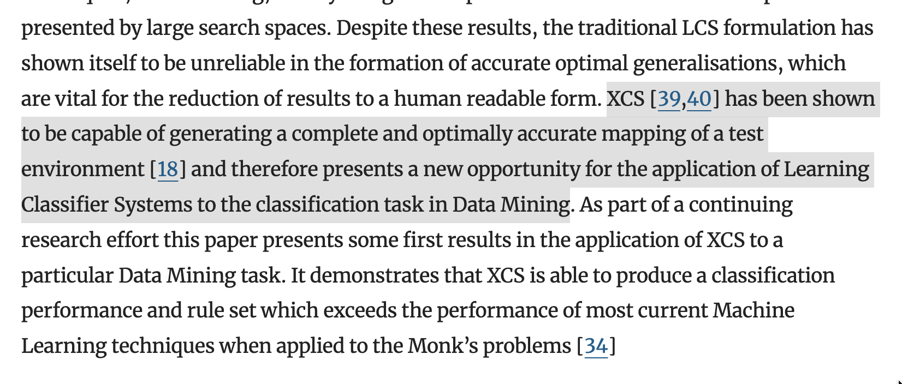
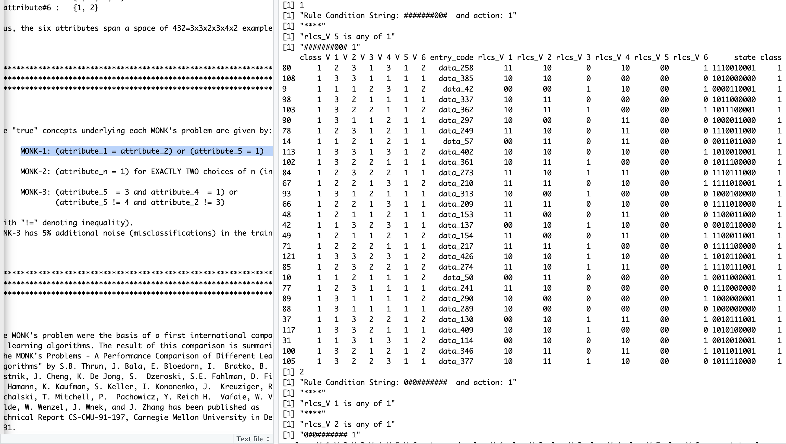
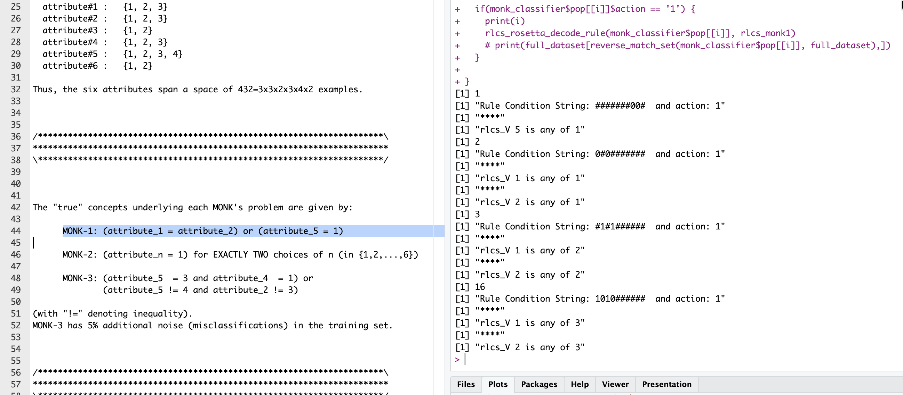

## I found another dataset for testing...

As I mentioned [here](https://kaizen-r.github.io/posts/2026-05-03_RLCS_w_Factors/) a few weeks back, I modified the "rosetta stone" functions to encode/decode data with support for factors, so that RLCS could now work with numerical data, factors, binary strings (ideally) or a mix thereof.

But it's been a while since I last worked more specifically on RLCS and while running new tests I found some issues with the variables encoding... Hopefully this time around, I fixed it a bit.

More to the point of today, I came across a paper whereby people where using the MONKS dataset the evaluate the quality of an XCS (a variant of LCS on which RLCS is inspired indeed).

And I thought, so if others use that to validate their implementation, would RLCS fare well with these?

## Long story short

It actually kinda fits on one picture:

It just works. I limited some parameters so that I keep "only" 50 rules of these found (more would work on the training dataset).

Finding those that match on the **training** set and going through them, one could wonder, as some rules appear that do not match the statement, but then you need to remember that for a datamining exercise one would use the **complete set.**

## And so I moved to Full dataset for MONK-1

Using the "test" dataset, one can move from supervised learning to data mining exercise (which is what I wanted to check based on the paper I had read).

And heck, perfect score :)

## Conclusions

At least, my RLCS implementation works just fine for one exercise that others have deemed relevant enough (back in 1999) to write an actual paper on validation of LCS...

So there is that.

And although I'll need to verify further, it looks like I fixed a bug with the rosetta stone functions for factors.

Good. Moving on :)

## References

The Paper that motivated this entry: <https://link.springer.com/chapter/10.1007/3-540-45027-0_12>

Which I found here: <https://link.springer.com/book/10.1007/3-540-45027-0>

Original Dataset copy (AFAIK), but with bad certificate: <https://archive.ics.uci.edu/dataset/70/monk+s+problems>

Same dataset on Kaggle: <https://www.kaggle.com/datasets/lavagod/monk-problem>

## 
