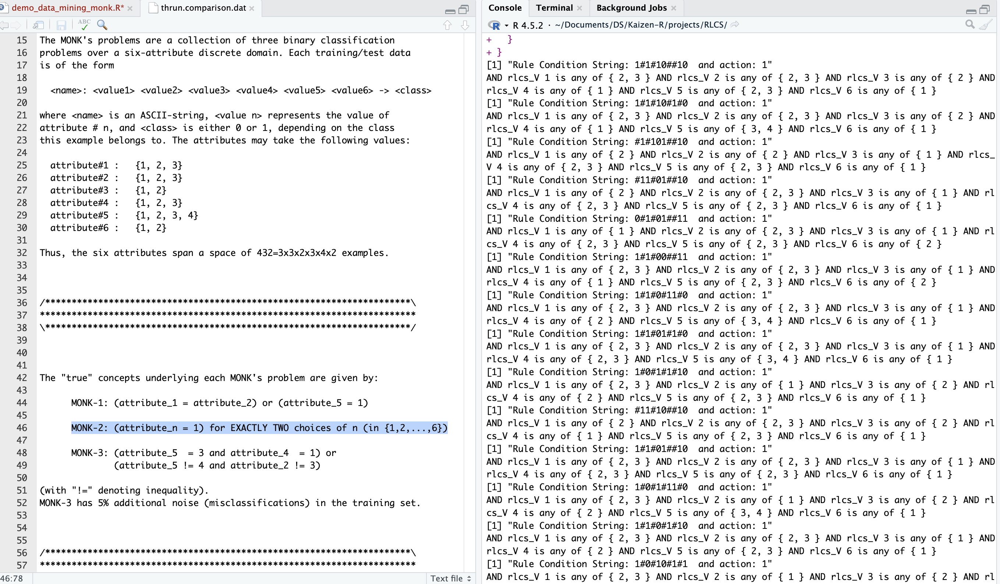
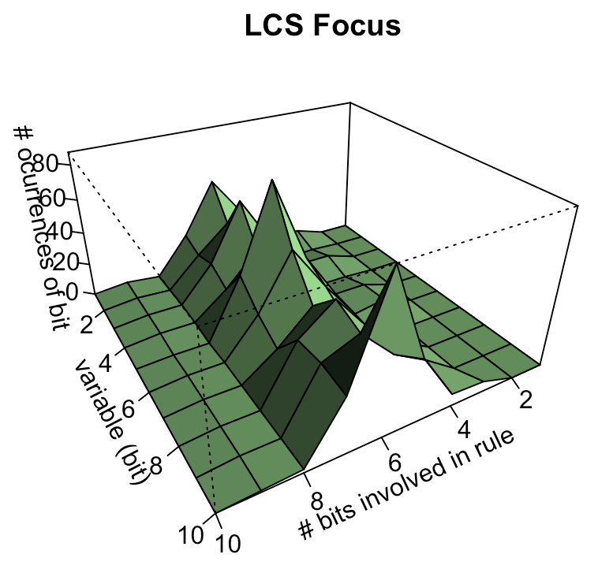
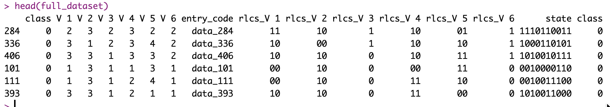
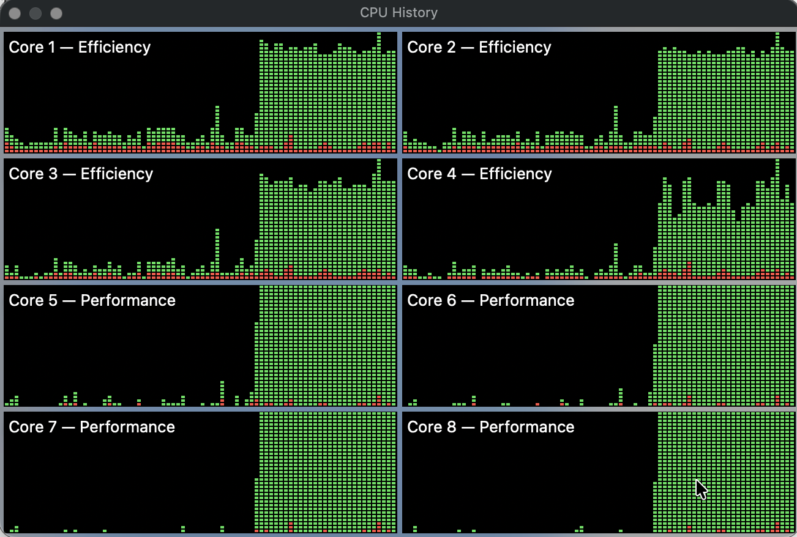

## Indeed it works...

I continue while I'm at it with the exercise for Monks dataset, now moving on to the slightly more complicated second problem.

## Intro

The second Monk problem involves controlling for all variables so that exactly two of them are equal to 1.

Let's look at what RLCS produces for it.

## Perfect results

First the results, so as to understand this: It works perfectly.

## Interpretation

I haven't checked every single rule, granted, but if you look at the profile and the rules definitions, you will see how this works:

So there are usually 6/10 bits involved as fixed in a rule. To understand that, you need to see how we encode the variables. Some are in sets of values {1,2}, others {1,2,3,4} or {1,2,3}. (That last set is sub-optimal for RLCS, because it uses up 2 bits per variables. Never-mind that.)

The logic holds!

The bits variables with exactly one bit are involved more often (when there value is 1).

The bits with 3 values are less often involved because some specify 1. Same for sets of two bits for 4 values. Anyhow, the profile makes sense.

And so does the resulting profile for the population of rules generated by the RLCS package for this data mining exercise.

## On parallel running

As there are quite a few more rules involved here, and consolidating them might take time, I went ahead and ran it in parallel (using the built-in RLCS options), so as to give it more time to look for better rules, that's it.

It's only because I don't want to wait for several minutes when I can wait for 2. But it changes nothing about the concept.

## Conclusion

Well, it works. Confirmed. On harder problem, it takes more processing, sure. But it gets to the perfect results regardless.

## References

These are the same references as yesterday.

The Paper that motivated this entry: <https://link.springer.com/chapter/10.1007/3-540-45027-0_12>

Which I found here: <https://link.springer.com/book/10.1007/3-540-45027-0>

Original Dataset copy (AFAIK), but with bad certificate: <https://archive.ics.uci.edu/dataset/70/monk+s+problems>

Official citation: Wnek, J. (1993). MONK's Problems \[Dataset\]. UCI Machine Learning Repository. <https://doi.org/10.24432/C5R30R.>

Same dataset on Kaggle: <https://www.kaggle.com/datasets/lavagod/monk-problem>

## 
