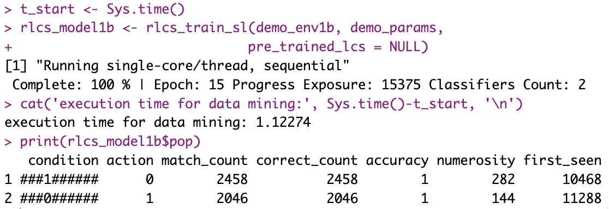
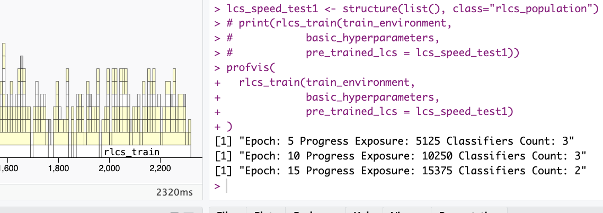
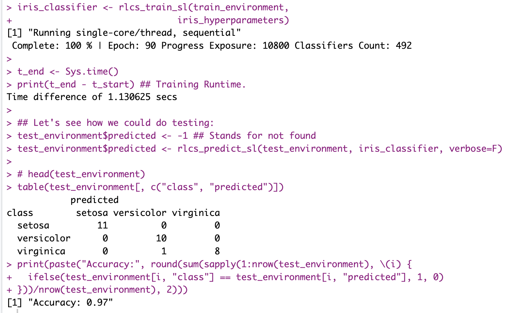

## It's still not fast, maybe never will be and yet...

Alright so I've looked into quite a few alternatives by now.

Over time, from the basic functionality, and using lists mostly, I have (today focus is on speed, not other things):

-   Vectorized most operations where I could

-   Prepared versions for parallelizing processing, by either:

    -   cutting datasets in subsets (which necessarily is often affecting models output quality)

    -   Or simply running multiple "agents" (not LLMs!) in parallel to cover more ground of the search space

-   Created matrices to calculate matches

-   Used R environments to reduce copy-on-modify effects

-   And probably a few other things.

I've tried even to use the GPU. It "worked" but I'll need to keep thinking about how to leverage those matrices multiplications at scale if I want that to get anywhere.

But that gave me an idea...

## More matches at once (work in progress)

Right so at this point, knowing which rule or rules of the LCS population match(es) a given environment (dataset) sample is done by multiplying two matrices, each with the sample (a vector). That's rather fast, indeed compared to regex matches...

But then I thought about it (inspired by the GPU exercises):

What if I wanted to get match sets (the above-described operation) not for one but for several (10? 100? 1000?) samples **in one go?**

That would **simply be multiplying with a matrix instead of a vector!**

Now the big issue is of course: Does it make sense?

For the algorithm to work, you want to check one sample at a time against the population, as it might generate a rule that in turn could be useful for the next sample (or any other sample after that for that matter, in a given epoch).

That's how the algorithm goes.

## A possible trade-off

Right, so I need to see how to make sense of this. It might still work. But in the meantime, I found out I could **pre-generate rules** for any matching operation that returns empty set. In other words: If a sample matches no rule - actually if it has no result in the "correct set" -, I could in theory skip the generating of a new rule if I have already one in store.

But there is a weird balance to consider:

Pre-generating rules means a cost, and sometimes a pre-calculated rule will never be used (that's the hope, after all: that rules in the population are good and general enough that they already match, and so a new rule would not be useful).

I'll try to dig into that too.

## Meanwhile, minor update

It turns out, I ran an operation a few times that is only needed once per environment sample, namely to take an input string and transform it into a vector of bits. It's a minor thing, but if I do it 2 or 3 times per sample, for each sample, and repeat that each epoch, I could easily have a few hundred thousand operations right there...

In supervised learning or data mining scenarios (not so much in RL setups), we could do that calculation for the full environment dataset in one go before proceeding with the algorithm, and call these values (from the R environment, it gets confusing sorry), instead of recalculating them.

You might ask, all these "tricks", are they getting anywhere?

Well, here is a runtime of the "not bit 4, 10 bits string" today, on the very same laptop (but about one year older if anything):

And here is a picture taken from [here](https://kaizen-r.github.io/posts/2025-05-25_RLCS_overall_faster/index.html#what-about-iris), a year or so ago:

And how about with Iris dataset?

Here the trick is still very much related to choosing the right hyper-parameters, **and yet** here a screenshot which you can compare with last year:

There could be a miriad of factors influencing here, granted, but heck... It does seem to work better, right? :)

## Interlude

Yesterday I came across a 20% discount offer on new Macbooks. That's... A lot of money if you consider the high end devices. Plus, Apple is expected to rise prices (because of increase in chip/RAM costs because of GenAI craze and datacenters... It's better I didn't comment on that).

So all in all, I was looking at a few hundred bucks in possible savings... If I acted there and then.

But then look:

-   Do I "need" a new Macbook? Objectively no, although I'm curious about what effect on GPU use this could have, but that's secondary to my library.

-   Could I get 100% faster run-times of all my simulations? Yes, that's what benchmarks say anyway, and actually quite a bit more if I considered M5 Pro with 18 CPU cores, of course... 4 times faster run-times, that sounds **nice**... But instead of depending on better hardware, **I should keep working on improving the code** (aside from clean, as you see I keep thinking about reducing run-times somehow).

-   I kinda promised myself I'd wait for the next generation, the M6 chips, the 2nm transistors, and whatever magical improvements I'm hoping to see there. I've been waiting for a while, I should wait some more... (Although I truly don't care about the touch screen and whatever other stuff, just the CPU/GPU)

-   Look, my MacBook Air M1 is working **just fine**, I got it in November 2021, so I should definitely wait, if for nothing else, because I believe in this here: if you hadn't noticed, buying new computers is adding contamination to the World, and you might have noticed, that's bad. A lot of contamination by the way. So I should be sure I **truly** need a new device before I move forward.

Anyhow, these are some key reasons I held back. I don't know, but actually thinking about making the code better instead of moving to faster hardware, I'm actually quite happy about that.

Would I "like" a 4-5 times faster CPU? Look, if you've read my blog or if you know me a little, for sure you'll know: Yes, obviously.

But I'll save it for the future, for now.

## Conclusions

With time, the code is getting more... Involved. Less easy to follow somehow. Messier, support for GPU (useless as it is), pre-calculating certain things, using environments instead of passing values, mixing matrices with lists comprehensions, vectorized operations, and parallelizing stuff in different manner, all add to the already not too easy algorithm (what with its several hyperparameters).

But overtime, too, I've managed to profile run-times, and get substantial speed gains. So it's not gone to waste, at least.

Will I manage to keep improving, more than marginally? At this point, it's less and less clear, and yet...

**I'll keep trying.**
