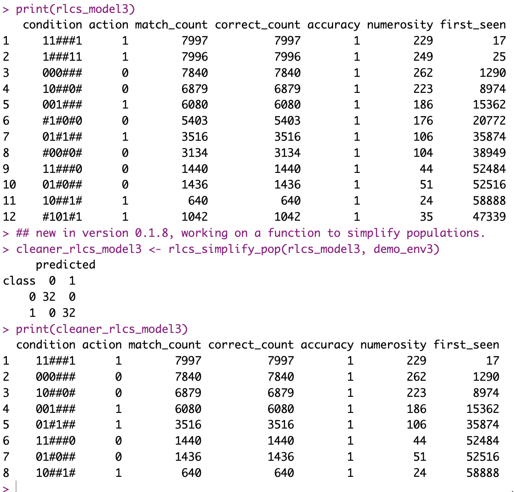

## While reading papers...

I came across a paper (not by mistake, I search for papers that are relevant somehow to the RLCS package :D) discussing algorithms to simplify populations.

One of them seemed quite straightforward. It's called in the paper the "Wilson's Algorithm".

So I thought I'd try my hand at it.

## The algorithm

Well, if you get a population of rules, sorted by some measure (in my case, a mix of accuracy, generality & numerosity, in decreasing order), then you already know the best rules are at the top of your list, and the worse ones at the bottom.

And then a simple idea comes to mind (but it's indeed easier to read it described in a paper):

-   Try and remove rules, in my case, go bottom-up the list,

-   at each step, test for current quality of your population, without that rule

-   If the quality is the same, then iterate with the new population that doesn't contain said rule.

That's it. Pretty straight forward.

Of course, this is affected by the choice of sorting, as well as what you test against (which dataset) and which measure.

I choose to let the user select which dataset to work against in trying to simplify the population, but to be fair, it makes sense that you would try only against the training dataset.

As per the measure of population quality, I stick with the simple accuracy (how many were correctly classified, versus total samples in the environment).

Anyhow, to the results...

## It works nicely for data mining

Well, that makes sense, but it's good to actually witness it.

Here is what you get with "mux6":

The "MUX 6" dataset **can be covered by precisely 8 rules**, and they are discovered by the algorithm, but by default, alongside them other rules are discovered that are correct, just not the ones we want. So I try to run the "simplifier" as described on the proposed population. I haven't done **much** testing though, so that particular result could have been a fluke. And yet, in this instance, it did what was expected just fine.

## But it affects results in supervised learning

Well, by removing rules learnt that work (that's why they're in the model in the first place), **you remove details**, **more precise albeit less commonly used rules**. That will affect in particular (I have to think through this a bit more) around the decision boundaries separating classes, particularly for overlapping data points.

While you don't affect results by simplifying against your training environment, **you might loose some information that did exist and was true**, but just wasn't necessary for the training set. However, **it might be relevant information for generalization**. And so in doing so, you might affect accuracy against a *testing* dataset.

And indeed, in my (short, fast, easy) tests against the iris dataset (always that one), I confirmed that a population that gets **97% accuracy** against a test dataset (held out of training) **with 600 rules**, when simplified, **goes down to 90%, but with only 22 rules!**

That's a big trade-off and an interesting lesson right there.

## Conclusions

The algorithm I chose to implement is very straightforward. I implemented it without much consideration for speed, mind you, and that means many operations and a bit slower that one might like for large populations/datasets.

But, straightforward or not, **it works**. In data mining, quite nicely indeed.

In Supervised Learning, we can already conclude that removing rules that might appear somewhat redundant is in fact hindering the generalization capacity of the model.

And that's a **good lesson**. Maybe in some cases we want simple populations (22 rules are easier read than 600), but sometimes we want more detailed models that generalize better.

We can't get it all, I guess.

## Resources

The reference paper I found here

<https://sci2s.ugr.es/keel/pdf/keel/capitulo/Orriols2004-ReductXCS.pdf>
