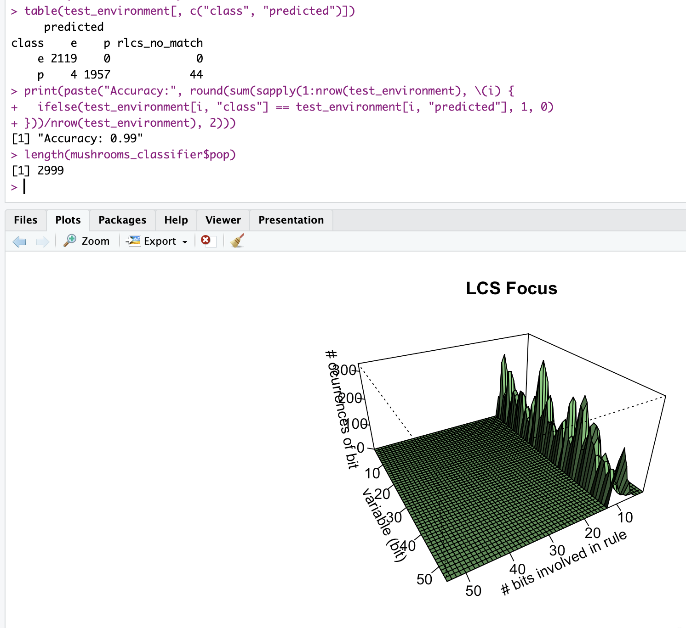
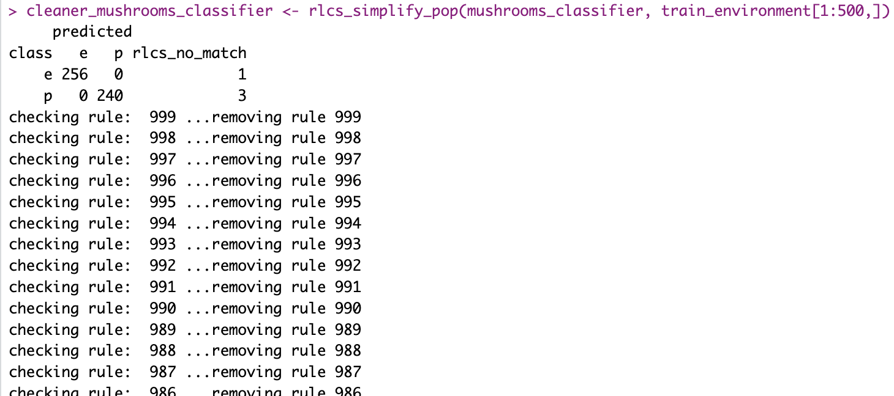
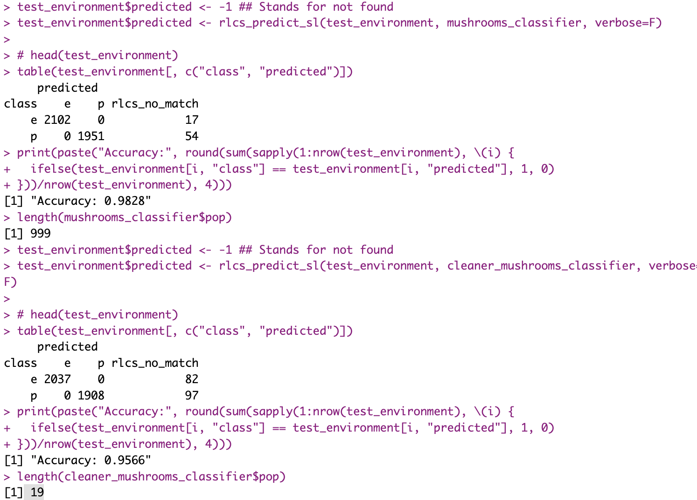
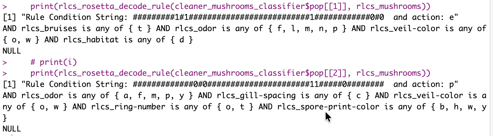

## A bit of validation

I'm starting a collaboration (really, thus far, I'm getting help from some University contacts, but **more on that in the future** - I'm actually pretty happy about that thing, but it's not officially a done-thing yet). And while discussing, a few things potentially valuable for RLCS came up. I'm lucky like that.

Among other things, it was brought to my attention that I really should "benchmark" RLCS better. And so, among many other aspects, I shall **look into more datasets** out there.

On the way to that I discovered the {ucimlrepo} R package, which I'm sure is very mainstream and yet... it just so happens, I didn't know about it until today 🤷

## Testing on the "Mushrooms" dataset

Today I thought I'd give a go at the UCI ML "Mushrooms" dataset. (See references.) And it's already been... Interesting.

So, for one, here a short summary:

-   22 variables, of which one is in fact useless (at least from my copy, it is single-valued, so I remove that)

-   for 8000+ samples

If you've followed (but otherwise, no matter), that's possibly a bit too much for RLCS. Well, not "too much" per-se, but it will make things... **A bit slow**. In fact, after passing things to my rlcs_rosetta_stone function, I end up with **strings of 53 bits**.

With some rather default hyperparameters, that would take too long to process, and given the number of samples, I might **need only much fewer epochs**...

With that in mind, reducing things enough and using 4000 samples for training, it still takes about 5' for training. I'm pretty sure I could get to comparable results much faster with better selection of samples/parameters, but that wasn't the point for today.

Let's go to the results.

## Some initial results

You might notice, the results (99%+ accuracy) are good for rules that specify less than 15 out of the 53 bits.

Then again, that's for 3000 rules. Too much for anyone to interpret.

So I re-ran the thing (to get to a 1000 rules population to begin with). Then I use 12.5% of the training set as reference to try and reduce the population size (that algorithm works but right now is very slow, which is why I work on a rather small subset...).

And then we can compare, like so:

## So what?

Well, I went for another dataset to actual results (albeit the processing time was slow) in less than an hour overall.

Which tells me the library is starting to be sufficiently comprehensive to repeat the exercise rather fast; and **it works**.

Actually, let's have a look at the first couple of rules. Remember the Mushrooms dataset has 21 variables, and some rules work great with just 4-5 variables:

## Conclusions

So yes: Slow, sure, but **"eXplainable Machine Learning"** modelling, right there.

There is **much more to be done**. If nothing else, use different quality measures, run on (many) more datasets...

The **hyperparameters tuning** is going to be an issue for adapting to many datasets...

And the resulting model(s), from past tests, are **not as good as Random Forests**, for instance...

Alright, that's **all fair: there are limitations**. It's definitely **not a perfect ML tool** (well, my implementation of it, anyway...).

But there is value, too, and the interpretability and approach (metaheuristic, GA), it is all very interesting. To me, that is :)

For the next couple of weeks though, I'll hold off testing/coding more stuff, and try to get on top of my reading list (which keeps growing). The balance is difficult for me, but I do like to read, and coding/writing is only ever about what I already know, I guess. If nothing else, I got a few papers on my todo, plus a few books...

So a "pause of coding anything" for two weeks it is.

## References

<https://archive.ics.uci.edu/dataset/73/mushroom>
