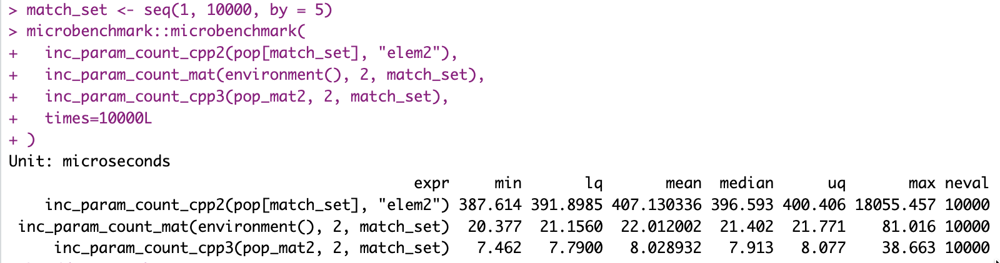

## I was about to go for it...

First I need to test whether my expectations make sense. So today I just wanted to run some tests.

The slowest functions right now are those that increment counters inside the population. So if a rule matches, I need to add to its match count, etc.

Of course I do it in bulk, and yes I'm using C++ for that even, but still it's the slowest function (or maybe simply the one most called).

But changing all the code in the package to stop relying on lists to move to a matrix-only setup is going to be a bit of a challenge (and the current code does work, so breaking it is not a fun idea).

So first I want to see **if** there will be a difference!

After some tests, yes, but **depending on how you measure things,** less than I had hoped.

As it turns out, sub-setting rows of a matrix is costly. While updating a column is not. And yes, using C++ seems more than promising again...

## Some results, visually

Here the first full test, was done with profvis():

But that's very little, so I kept going and I tried to run a version of the matrix approach but with C++ a bit.

And then I ran a few tests with profvis and I was not... impressed, actually things were sometimes incoherent...

So I switched to microbenchmark, which would hopefully be more helpful, and heck...

## Conclusions

In all cases now I'm using "zero-copy".

If I don't subset, updating a column seems to be almost instantaneous compared to updating a list.

Still, 40% runtime reduction was good news up front, and that would apply to 30% of my overall RLCS runtime (if I do everything perfectly, that is), which would add up to \~12% overall runtime gain...

I'm talking about many many changes of the code, almost a complete overhaul here, so for a 10% improvement, I'm weary of it...

(EDITED)

Now however other tests and further investigation into runtimes are showing (much) more promise.

And all of the sudden the whole thing starts to make more sense, i.e. the cost of refactoring most of the code vs the positive impact I'm expecting to gain overall (now more like 20%, and with potentially more space for improvement)...

To be continued!
