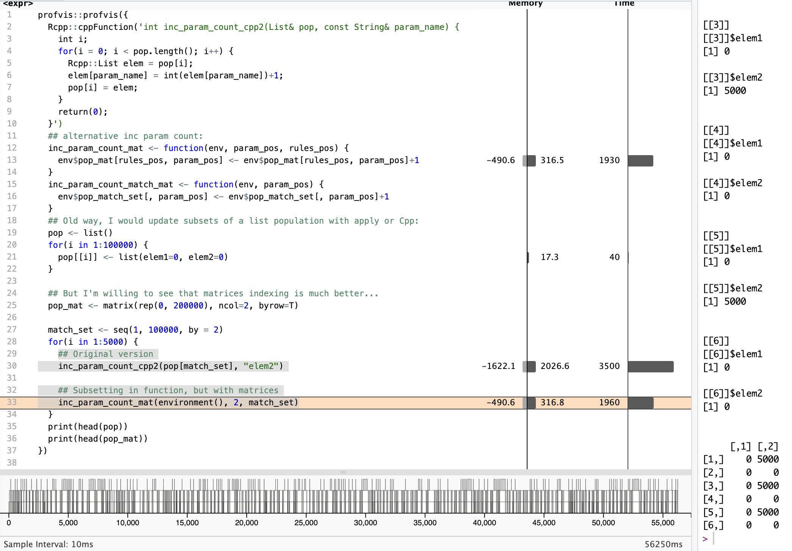

## I was about to go for it...

First I need to test whether my expectations make sense. So today I just wanted to run some tests.

The slowest functions right now are those that increment counters inside the population. So if a rule matches, I need to add to its match count, etc.

Of course I do it in bulk, and yes I'm using C++ for that even, but still it's the slowest function (or maybe simply the one most called).

But changing all the code in the package to stop relying on lists to move to a matrix-only setup is going to be a bit of a challenge (and the current code does work, so breaking it is not a fun idea).

So first I want to see **if** there will be a difference!

After some tests, yes, but less than I had hoped.

As it turns out, sub-setting rows of a matrix is costly. While updating a column is not. Oh well.

## Some results, visually

Here the full test:

## Conclusions

Well, if I don't subset, updating a column seems to be almost instantaneous compared to updating a list.

But the moment I subset the matrix, well, it slows things down.

In both cases I'm using "zero-copy".

Still, 40% runtime reduction is good news, and that out of 30% of my runtime (if I do everything perfectly, that is), that adds up to \~12% overall runtime gain...

I'm talking about many many changes of the code, almost a complete overhaul here, so for a 10% improvement, I'm weary of it... But I will keep looking into this, because the change of approach might just make a difference in other places too. And this was a rather easy/fast/basic test, but maybe there is something to be done differently still. IDK.

To be continued...
