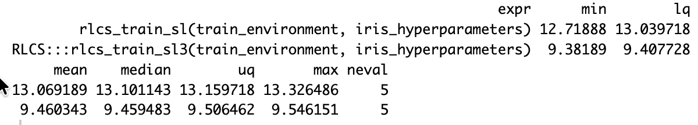
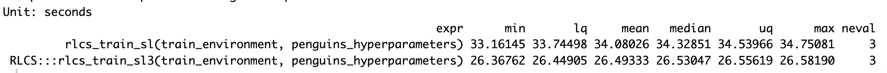
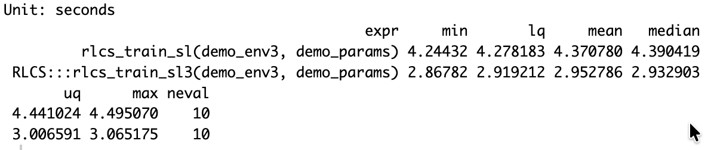
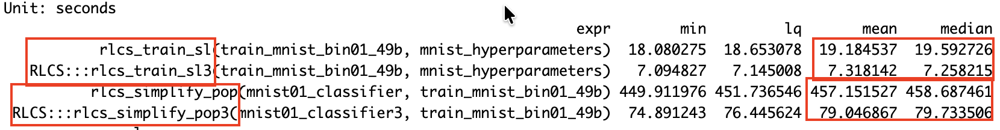
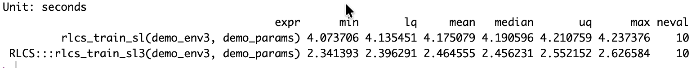
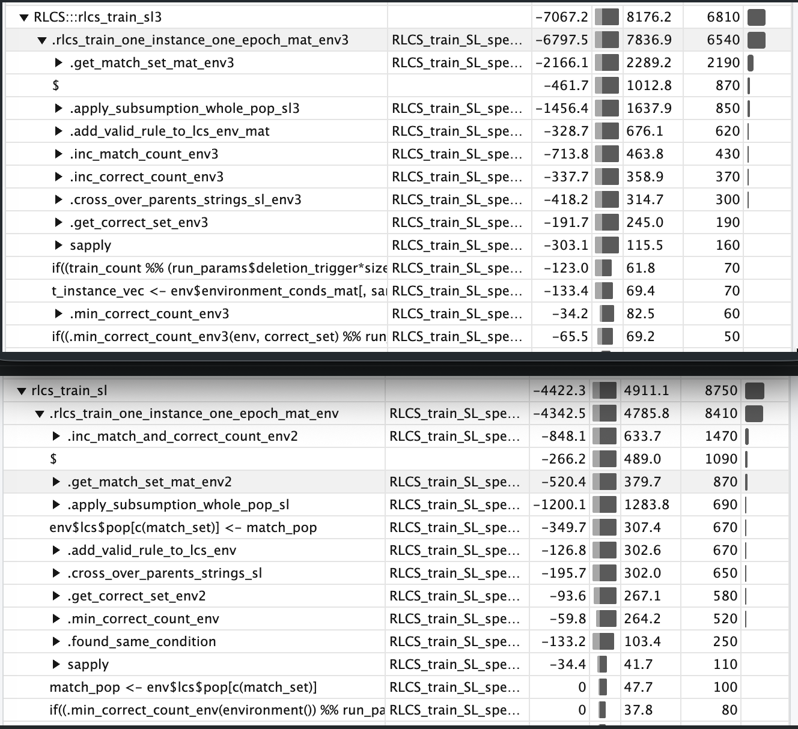
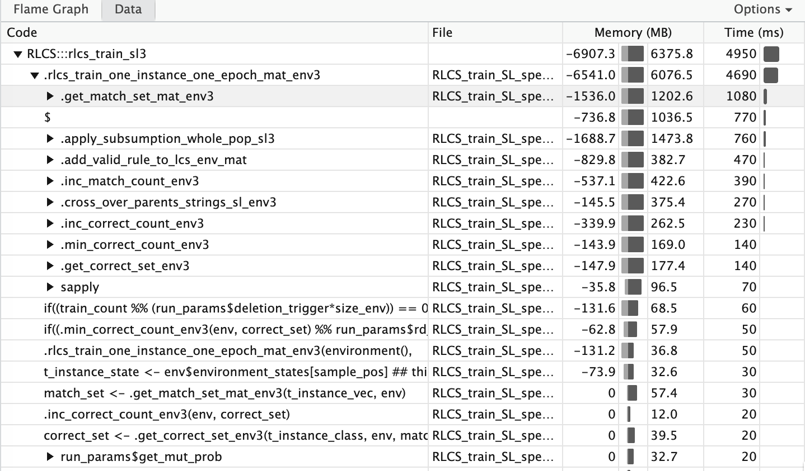

## It was a loooong weekend

So many modifications (and **so many tests**), I can't say how much went into it.

More or less, after thinking about it more seriously for the past couple of weeks, this was my whole Sunday (and most of my Monday afternoon).

But it worked!

## Intro

**RLCS in v0.2.0 is now basically ready to work without lists**, but solely with matrices.

And the **new version is faster**, depending on the dataset, **by up to 30%**. That's on top of the gains I've managed over the past – hum hum... – about two years (it's been a long way indeed!).

Interestingly (or maybe not...), the new version uses **zero C++ code** (for now).

And yet, it's already showing good gains, compared to the former version (which did rely on C++ for some parts).

## First Some results

Just so that we are on the same page of what the change of underlying data model got me there, a few sample results.

First one of the most tested datasets with RLCS, the (in)famous Iris:

But there is more!

## Other impacts

One of the recent implementations was a simplifier of ruleset.

But it was very slow... Well, it got a bit better:

So on MNIST binary (0/1 classes only) simplified dataset, first, **total runtime is at 36% of the original runtime!** Which is very cool to me, I just made it a bit **more than twice as fast**.

I will need to **better study why the difference in improvement is so large**, for MNIST vs Iris vs Penguins, for instance. (i.e. Why is the Penguins dataset processing runtime not improved in the same proportion?)

But also rather cool, is the new predict() function with the new underlying data model (matrices). If you check the example of MNIST above, predict is used heavily (in a loop) to try and simplify populations of rules.

**We just got from 457s down to 80s! That's more than 5 times faster!**

The importance of that is to make cleaning large rulesets (thereby **increasing interpretability** of models) more "practical".

### Well, not quite!

Actually, yet newer improvements (this afternoon), not based on C++ (which proved not great for the few new first tests) gave more improvements!

From 2.9s to 2.5s with MUX6:

{alt="Some simplifications and voilà!"}

And another 1.4s was shaved out of Iris processing times, and another second for the MNIST49b exercise (6.7s down from almost 20!). And rule-set simplification for MNIST populations went from the recent 79s down to 72s. (meh...)

## A short analysis

So very basically: matrices rows/vectors indexing works faster than looking in lists with loops. And even with C++ it would seem.

It's faster now because increasing counters is faster now, and in spite of being slower (for now, in R) for matching (I have ideas for that, we'll see).

Of note, profvis() is however problematic and should be used with care, as there are too many factors that can impact runtimes (even when fixing seeds for the stochastic parts of it).

Still, it's useful. After simplifying further some checks (thanks to better choice of initialization values), here yet another drill down for the very latest version:

Anyhow this is on top of past refactoring, [for instance 1.5s gains](http://localhost:5499/posts/2026-08-19_RLCS_CppZeroCopy_And_CallAsNeeded/) about 2 weeks ago.

## It's far from finished

In the re-factoring, I have:

-   Created several versions of functions,

-   broke printing and plotting for older code versions

-   included and then hidden (commented) lots of tests (calls to browser(), cat()...)

-   and I haven't even looked into parallel computing (almost, and yet), which was working fine in the former versions

-   Not to mention the already broken GPU support

-   And I'll have to revisit almost all of the RL use-cases, too :S

Moreover, some calls are very slow that I believe I will be able to pass to C++ and make (hopefully much) faster!

Having the screenshots above will help with judging (for same hyperparameters, I can check runtimes and accuracies).

## Conclusion

A hell of a workload there over the past couple of days, and it's all still very messy, **but so satisfying**.

I was **starting to get to the end of the S-curve of improvements**, it was all still getting better, but much slower than at the beginning.

I was **working on marginal gains**. Part of it was my **reluctance to re-do the whole thing**\*. But some [recent tests](https://kaizen-r.github.io/posts/2026-08-23_RLCS_some_tests_matrices/) comparing applicable lists vs matrices operations runtimes **got me excited again**.

And here we are!

Now I don't know if (this) yet **another** \~20-30% improvement in runtimes (depends on use-cases) generally would warrant the satisfaction I feel, but yes... It is a good feeling!

In short: **I feel oddly satisfied by the new results.**

For the Iris dataset, with the *same hyperparameters and seed*, I went from about 10.8s to 4.9s, so I **reduced run-times in half**.

## A personal note

\*Many, today, would surely tell me: Just give it to an AI! It can do it for you! But I'm sorry, I still insist on working on this with my own two hands and (surely limited) human brain... And one thing I'll tell you: The satisfaction I mention, it doesn't exist without effort. And the ideas to make improvements, they come from the struggle.

Could I have done all this (heck, the whole package) faster 1.5 years ago? **Sure**. But what's the learning, where's the effort, how can one be as happy about it all if it's fully delegated? I mean, this is a hobby for me. Definitely useful (I believe) but not life-altering stuff right now. If at work, maybe, sure, where needed/useful. Productivity rules. So I do use genAI for some stuff at work. I even have theoretical conversations with an LLM from time to time.

But the whole RLCS package was born after reading a book (paperback, mind you). And coded from scratch from my own understanding of the algorithm descriptions I got from videos (and more books!). And updated and broken and fixed and improved since November '24 **solely by me**, without any AI. **The goal was never productivity, but learning.**

Is it better code for it? Of course not! I am not as cocky as to pretend I code better than Claude Fable 5...

But what I learnt (and I'll keep at it!), I believe was better learning than if I had delegated more of it.
