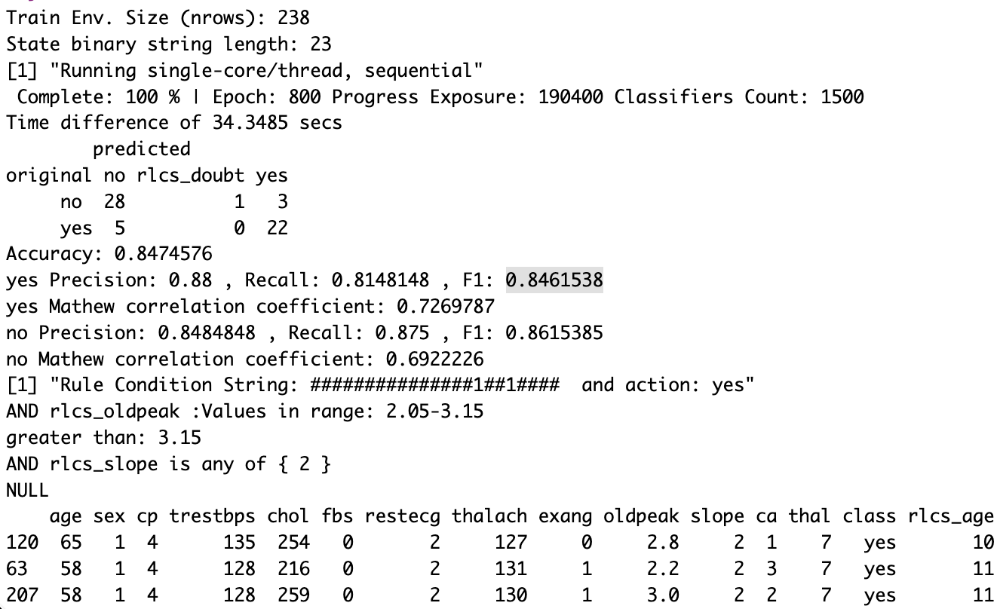
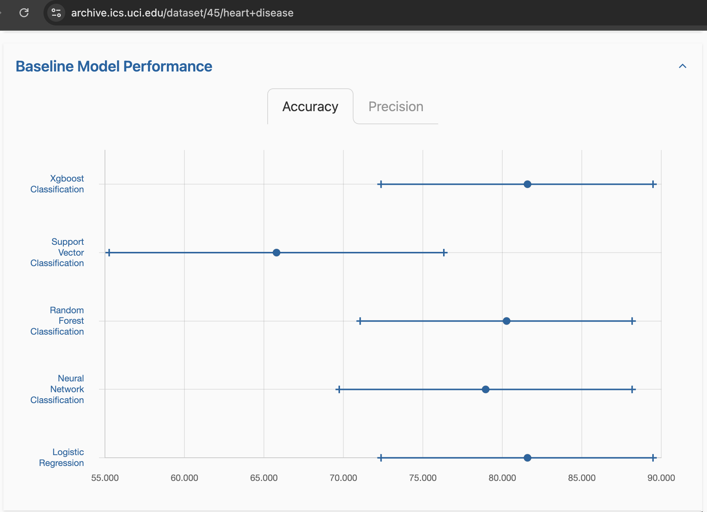

## After the clean-up

I'm starting to work on a more serious validation of the RLCS package and (my implementation of) the underlying algorithm, which is technically a [Michigan-style LCS](https://en.wikipedia.org/wiki/Learning_classifier_system#Michigan-Style_Learning_Classifier_System), derived from the [XCS](https://direct.mit.edu/evco/article-abstract/3/2/149/728/Classifier-Fitness-Based-on-Accuracy) revision of the algorithm.

## New measures

Inspired by some work of some new acquaintances at the University Rey Juan Carlos (URJC), I am focusing a bit now on better evaluating my implementation. One thing is, up until now, I have focused solely on accuracy.

But there are other ways to measure the quality of a classification model.

So I implemented two functions to evaluate the F1 score (and precision and recall) and the Matthew correlation coefficient.

As these focus on positives/negatives, whenever there are two or more classes, one needs to decide which one is the positive. For now, I just calculate them for each class in turn.

## More datasets

I have played a lot with demo datasets for data mining, with the Iris dataset, and also more recently with the "monk problems" and "mushrooms" (from UC Irvine).

All classics for training Supervised Learning models.

I now have thrown into the mix as well:

-   UCI Hear Disease (297 samples, 13 variables)

-   UCI Wine Quality (4898 samples, 11 variables)

-   UCI Breast Cancer (569 samples, 30 variables)

-   UCI Adult (48842 samples, 14 variables)

The interesting thing with these (alongside Iris and Mushrooms), as it turns out, a mix of number of samples and/or number of variables, most of which are numeric, by the way (far away from my demos of binary strings...).

For instance, this has had an enormous impact when it came to choosing the "right" hyperparameters, including the length of bit strings for encoding.

Actually...

## An unexpected lesson

It **shouldn't** have been a surprise, really.

Alright so here goes:

My "Rosetta Stone" encoding function can go as high as 6 bits per variable, meaning I can encode up to 64 "bins" for a given variable. But if there are in fact 64 of more unique values, then having more bins means **adding granularity** and bits to the bit string.

What's interesting is, as it turns out, it might actually help the RLCS algorithm to use **fewer, larger bins**: that means a smaller bit string, smaller search space, and faster processing. But also (and that was **"a thinker"**), that means **one bit might encode more information**.

See: If I split one variable in **two** bins, I can **separate high from low values with one bit**. That bit then becomes *potentially* very important for the classification effort.

For instance, for the Heart Disease dataset, using a maximum of two bits per variable (up to 4 bins, then), and so going from, with 238 samples for training:

-   the default **43 bits**, **\~1 minute**, **73% accuracy**, and for detected heart attack class: **F1=0.65, MCC=0.46**

-   to a total of **23 bits** strings for input states, **\~34 seconds** runtime and **84% accuracy**, and for detected heart attack class: **F1=0.85, MCC=0.73**

(Same training/testing dataset distributions if I didn't make any big mistake... and yet to be fair: I would need to run a few more executions, because as we shall keep in mind: the RLCS model training process is stochastic... Anyhow, it's a start!)

On the negative side, fewer bits mean possibly more input **information loss** of course.

But after quite a few tests in the past couple of days with more datasets, it would appear **there is a balance to be found!**

What I'm saying is: It appears **this might warrant some deeper investigation** right there.

## Stratified sampling

One too-simplistic yet really bad practice I have been following is sample at random from datasets. For imbalanced class representation, that doesn't help.

So I fixed that in my separating training / testing datasets.

## On the results

Well, it's (no surprise) slow to train them, and I'm not always super happy with the results, but let's have a look at them in context.

And so this is not representative, this is one run, for the heart disease dataset:

And I was a bit unhappy about the 84.7% accuracy (and .85 F1 score, for example) there (80% training, 20% testing).

Then, I found some of the datasets model quality measures were published alongside the data itself at UC Irving.

And here are the baselines for the heart disease dataset:

It owuld appear, 85% is not all that bad after all...

Also: **have you seen the decoded first rule?** It's quite readable (but that's also a cherry-picked rule of course).

## Conclusions

Still much to be done just to evaluate my implementation, but I think I am well on my way.

A more serious evaluation of the approach, its drawbacks (runtimes, but also complex encoding of input, too many hyperparameters...), but also its quality as a model for supervised learning, I think are all good things to have.

And so for the time being, I will spend a bit more time on that topic.

## Resources

Section 4 of this paper set me on my way: [Paper on Data Complexity](https://www.sciencedirect.com/science/article/pii/S0925231225027481)

New datasets:

-   <https://archive.ics.uci.edu/dataset/45/heart+disease>

-   <https://archive.ics.uci.edu/dataset/186/wine+quality>

-   <https://archive.ics.uci.edu/dataset/17/breast+cancer+wisconsin+diagnostic>

-   <https://archive.ics.uci.edu/dataset/2/adult>
