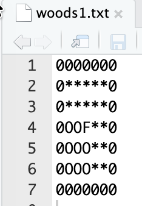
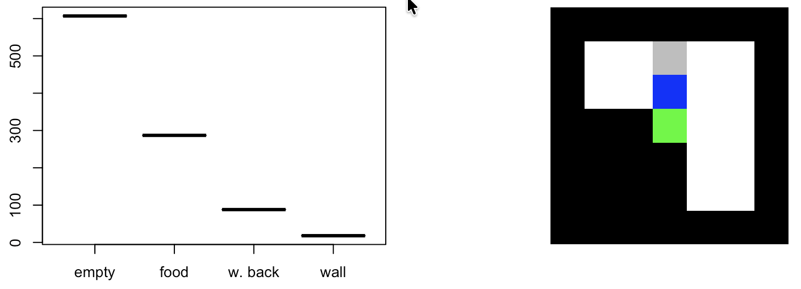

## I mean to make sure it works...

Today while looking for some test scenarios I knew from past readings, "woods" and "mazes", I came across [Dr. S. W. Wilson's webpage](https://www.eskimo.com/~wilson/), and boy it's been a fun day of readings!

Anyhow. Today I implemented some of the most common "LCS" (really, XCS) testing scenarios, and ran through them with RLCS...

## Some "worlds" for an agent to play in...

So I tried to look for where I originally (quite some time ago) found the different "worlds" to serve as playgrounds for an LCS "agent", but I'm afraid I can't seem to find that. I did look for them today and found some of the original reference (AFAIK), and I link them in resources.

To the point. Wilson put forth "Woods1", which compared to [my past exercises](https://kaizen-r.github.io/posts/2025-03-16_RLCS_RL_WorksAgain/) is quite simplistic – although to be fair, I made my own simplified version (see below).

But as I try to validate my implementation, I should use whatever the research community has used in the past as my benchmark of sorts, shouldn't I?

(I had to add walls around the proposed setup because my world-engine uses that to prohibit the agent from taking wrong turns... The original woods1 scenario is in fact quite different, in that it repeats in all direction infinitely, meaning the agent would fall from the right (say) only to appear on the left of a therefore-infinite matrix... My version in that sense is simpler)

The graph on the left is telling you statistics of the last 1000 movements, and **although there are many more walls and empty** (and, technically, walk-backs) than food cells, the **agent finds the food in 30% of all its movements**.

Note: Once found, in this setup I reset the world, and make the agent appear randomly in an empty cell. [My original world engine](https://kaizen-r.github.io/posts/2025-02-16_RLCS_World_Explorer_v001/) would keep going and move the food around instead (not to mention I had "enemies", which are not considered in these baseline worlds, I guess...).

Anyhow, this does mean, the agent learns how to find food in woods1, if not optimally (not part of my tests yet), definitely way better than random.

Well I've now tried my RLCS-powered agent in my version of woods1, woods2 (with only one type of walls and food, and not infinite either), woods101, as well as mazef1 and mazef2 with success.

However mazef3 and mazef4 are proving rather challenging (most of the time) for my implementation (which is not surprising given what the agent currently can "see" from its position, and how these two worlds are designed). This is interesting as something to look into further later.

## Some lessons of today's runs

Well, it turns out, aside from the positive effect of "reward shaping" (but it is not necessary for things to work), in some scenarios, too large a population of rules can actually hinder the agent's capacity to survive!

For mazef1 or woods1, a 100 rules population (remember I still do online learning), ensures that not too many "poor rules" match, influencing the reward system, the GA system, well, everything really.

My current working theory about that, given my implementation:

If say 2 rules are "good" and positive, but they contribute say 5 points each, and then say 200 rules contribute **in the same match set** and **the same action** (used for proposing the movement choice) each contribute say -.1 reward, I get a total of -10, and if f**ewer rules in the match set**, even negative ones **propose a different direction**, maybe with a total direction score of -5, I'll choose the "wrong" direction, because it has a higher expected reward.

So, on top of the many existing hyperparameters already at play with RLCS, I also need to be careful with the population size, depending on the reward systems of each world, and the complexity of the world itself.

That's not too good news. Because it means it's harder to set things up so that the agent can learn a good solution...

## Side note

After reading through some of Dr. Wilson's papers, I am happy (and bothered at the same time) that I had come up with my own implementations and that some of them did correspond to what I suppose are best practices.

Two things I seem to have done the same way:

-   Encoding of "worlds": I don't use F, Q, O, G, b or \*. I use numerical matrices, but what I did do the same way is encode each cell into a 3 bits string, one for each possible cell value (which made sense in my original "world")

-   I also chose from the get-go to encode the 8 surrounding cells of my agent. Me I then "read them" from top-left, down, then top center down, then top-right-down. It's only because of my code for extracting the matrix for the agent's environment, really.

-   Another thing I did apparently the same way, is how I implement the passing of the "next step's reward". I actually update the last action set of rules with current action set average reward, not simulate the next step choice and extract that as a reward for current set (if it doesn't make sense, don't worry, it's only a detail). Same-same, but different than what I read (among other places) in Sutton & Barto's book, I guess :)

Bothered I am a bit too, because me designing my own solution was here overkill: had I done my homework better and read a few more papers back in the day, I could have saved myself a lot of effort.

However, as it turns out, me coming up with my own way of doing things also means I have a better understanding of how this all works. So, you could say, there was value in the struggle...

## Conclusions

For simpler worlds, indeed my RLCS package does its job just fine. One less thing to worry about.

It's all good, **all basic scenarios are covered just fine.**

But indeed, my implementation is probably somewhat simplistic for now, and for some scenarios it just doesn't distinguish between two equivalent states... Probably **because it lacks some context**. I'll look into that some day (when I have time, so... Not immediately :D). I've already concluded that either I increase its vision (i.e. I look further than the immediately surrounding positions), or I add some sort of memory to the system, which in essence would be... Equivalent.

Also, my current testing setup for these baseline scenarios, they don't limit to a max number of iterations for a given training. So if an agent falls in a "trap" situation and iterates there, it will never get out (not enough explore steps, maybe). And then rules will become stale, and no learning can occur. I believe that's part of the my issue with mazef3 and mazef4, I shall have a look next time I have... time.

Also, I haven't checked for improving the performance, meaning: depending on the "world", my agent might learn faster or slower, or maybe it takes a slight detour, and **I haven't worked those numbers**. Not urgent, though it is an interesting research topic right there... Again, some other time.

## Resources

[The author of the XCS algorithm](https://www.eskimo.com/~wilson/)

[The paper where woods1 was introduced](https://www.eskimo.com/~wilson/ps/zcs.pdf) (AFAIK)

[The paper where woods2 was introduced](https://www.eskimo.com/~wilson/ps/xcs.pdf)

[The paper with the introduction of the mazef1-4 worlds](https://dl.acm.org/doi/10.5555/646371.689029)

[Someone else had some such different worlds prepared](https://github.com/xcsf-dev/xcsf), alongside their own XCSF algorithm implementation, in fact.
